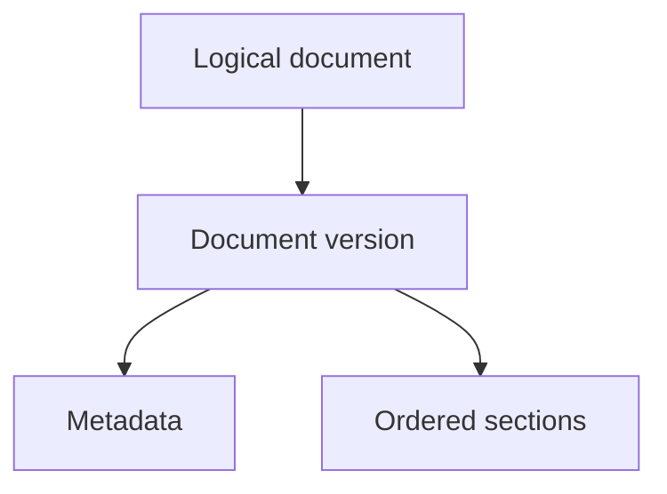
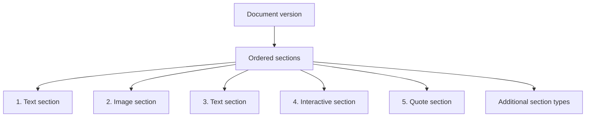
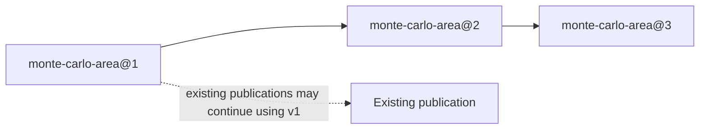
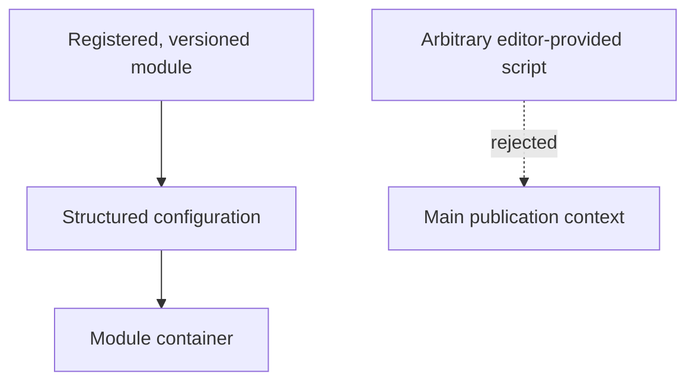
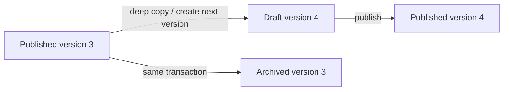
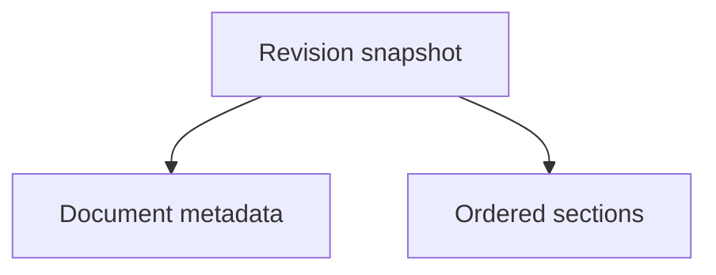

# Verso — Content Model

## Scope

This document defines canonical publication content: document versions, typed
sections, assets, interactive modules, and recoverable revisions. It does not
define how content is rendered, edited over HTTP, authorized, or exposed
through MCP.

Related: [system architecture](system.md), [rendering and cache](rendering.md), [web editor and preview](editor.md), and [identity and MCP](identity-and-mcp.md).

## 1. Content Model

### 1.1 Document

The primary publication unit is a logical `Document`. Its content is published
as a sequence of explicitly numbered `DocumentVersion` objects. The logical
document provides stable identity and lineage; a version owns the metadata,
sections, and nested content that are rendered.

An article is one possible document type.

Conceptually:



Logical document metadata may include:

```text
id (stable numerical document identifier)
type

status (derived from the current version)

finalized_at (null until irrevocable finalization)
finalized_by (null until irrevocable finalization)

created_at
created_by
```

The document ID is stable for the lifetime of the logical document and is the
authoritative key for public document lookup. It must not change when a new
version is published or when the current version's slug changes. The `slug`
stored in version-owned metadata is a presentation field for the current
public URL, not part of document identity.

`type` is a stable logical-document field. Each configured document type maps
to exactly one public route collection; for example, type `article` maps to
the `articles` collection. Editors do not choose the collection independently,
and changing a document's type after creation is not supported. Changing a
deployment's type-to-collection mapping is a route migration, not an editorial
metadata edit.

Version-owned metadata may include:

```text
version_id
version_number
based_on_version_id
state
slug
title
description
language
updated_at
updated_by
published_at
archive_accessible
```

Possible version states include:

```text
draft
review
published
archived
```

`scheduled` is reserved for a future scheduling feature and is not a valid
initial state or transition.

Document language is version-owned metadata because documents may use different
languages within one deployment. Document pages use this version language for
their HTML `lang` attribute. New documents default their language from the
configured UI language; an editor may then set the document language explicitly.

There may be at most one published version for a logical document. The
published version is the version resolved by the ordinary public document
route. A document with no published version may have one mutable version in
`draft` or `review`, but that version remains private. A logical document has
at most one mutable unpublished version at a time.

A manager may irrevocably finalize a logical document only when it has a
published current version and no mutable version. Finalization closes the
entire document lineage: no next-version draft, publication, import into its
draft, author or metadata change, series reassignment, archive-visibility
change, or other canonical mutation may follow. Existing inaccessible archives
remain inaccessible; existing accessible archives remain accessible. A final
document therefore has a permanently fixed set of public routes and assets.

`archive_accessible` controls whether an archived version is available through
ordinary public historical-version routes. It defaults to true when a version
is archived, so historical publications remain readable unless an actor with
the `document:archive:manage` capability explicitly hides that version. Hiding
an archive is a visibility change, not a content edit. Authorized editorial
users may still inspect hidden versions for management and recovery, in
read-only mode.

Document-type-specific fields may be stored separately or as structured metadata.

A version of an article may additionally contain:

```text
authors
subjects
series
series_position
```

A `Series` is a separate canonical entity that groups an ordered sequence of
articles. It has its own stable identity, title, and slug. An article version
may reference zero or one series and provide its `series_position`; publication
validates that current published members do not share a position in the same
series. The public series page at `/series/:slug` lists the current published
articles in order. Individual articles remain under their type-derived
collection route rather than being nested beneath a series, so an article keeps
one stable canonical URL even if its series assignment later changes.

---

## 2. Section-Based Content

Verso does not treat the entire document as one monolithic Markdown body.

Instead:



A section has a common structure such as:

```text
id
version_id
position
kind
data
```

The `data` field contains type-specific structured content.

---

## 3. Text Sections

Text sections contain Markdown.

For example:

```json
{
  "markdown": "Let $K/\\mathbb{Q}$ be a number field..."
}
```

A text section may contain:

* paragraphs;
* headings;
* lists;
* equations;
* citations;
* footnotes;
* code;
* links;
* inline images where appropriate.

Verso should avoid turning every paragraph or equation into a separate database object.

A text section should remain a reasonably large semantic unit.

---

### 3.1 Bibliographic References

Each document version owns a collection of bibliographic reference records.
Every record has a short name that is unique within that version. Future
Markdown citation syntax resolves a citation's short name only against the
loaded version's reference collection; it does not address a publication-wide
or external bibliography.

The reference's bibliographic metadata is stored as a structured object. Its
precise fields, supported import formats, citation syntax, citation styles,
and bibliography rendering are intentionally deferred. This storage model
does not prescribe how citations are numbered or sorted.

Reference records are version-owned nested content. Creating a next-version
draft copies them with independent identities, so changing a draft's
bibliography cannot alter its published or archived source version.

---

## 4. Image Sections

An image section references an asset rather than embedding image bytes in SQLite.

Example:

```json
{
  "asset": "prime-decomposition",
  "alt": "Prime decomposition diagram",
  "caption": "Decomposition of a rational prime",
  "display": "wide"
}
```

`asset` is a name in the version-owned asset collection, not an asset-store
path or an asset's global identifier. The corresponding binary object lives in
the configured asset store.

---

## 5. Interactive Sections

Interactive sections should reference controlled, versioned interactive modules.

Example:

```json
{
  "module": "monte-carlo-area",
  "version": 2,
  "config": {
    "samples": 5000,
    "show_grid": true
  }
}
```

The module may consist of:

```text
JavaScript
CSS
WASM
static assets
```

The module is stored as an asset or collection of assets and referenced from SQLite.

---

## 6. Interactive Module Versioning

Interactive modules should be immutable once published.

For example:



An existing publication may continue using version 1 even after later versions are introduced.

This prevents changes to an interactive implementation from silently modifying old publications.

---

## 7. Arbitrary Script Execution

Verso should not execute arbitrary editor-provided JavaScript directly in the main publication context.

The preferred model is:



If arbitrary HTML/CSS/JavaScript documents are supported later, they should execute inside a sandboxed iframe with an intentionally restrictive capability model.

Interactive modules are disabled in the initial deployment. The content model
reserves their versioned representation, but no module upload, serving, or
execution path is enabled until a dedicated security design defines module
review, integrity, isolation, and browser capabilities.

---

## 8. Asset Storage

Binary assets are stored separately from SQLite.

The initial implementation should support:

```text
local filesystem
```

The architecture may later support:

```text
S3-compatible object storage
RustFS
```

Typical assets include:

```text
images
PDFs
datasets
downloads
JavaScript bundles
WASM modules
stylesheets
```

SQLite stores asset metadata such as:

```text
id
object key/path
content type
size
checksum
created_at
uploaded_by
```

Each document version owns a collection of named asset references. An asset
name is unique within its version, maps to one stored asset, and may be used by
any section in that version. Markdown may refer to such an asset with a local
reference such as:

```markdown

```

`assets://` is a renderer-only reference form. It resolves only against the
loaded document version's named asset collection; it is never a filesystem
path, a public URL, or a way to address an arbitrary stored asset. The renderer
resolves it to the authorized version-scoped public asset route before emitting
HTML. Names and associations are copied when a next-version draft is created,
so editing a draft cannot change an earlier version's asset references.

The asset store itself must never be mounted as a public static directory. An
asset delivery handler authorizes every request. An ordinary public request is
allowed only when the asset is referenced by the current published document,
an accessible archived version, or an explicitly public theme or interactive
module. Assets referenced only by drafts, reviews, hidden archives, or private
editorial material return the same not-found response as an unknown asset.
Editorial reads require both `asset:read` and authorization to read the
referencing content.

The handler determines content type from validated bytes rather than trusting
an upload declaration, sends `X-Content-Type-Options: nosniff`, and uses
attachment download behavior for types that are not explicitly safe to render
inline. Upload processing records a server-computed checksum and writes bytes
under server-controlled, content-addressed object names; client filenames and
paths are display metadata only. Assets whose public visibility depends on an
archived version must be revalidated with Verso before browser reuse.

Document-owned public assets use a version-scoped route:

```text
/<collection>/<document-id>/versions/<version-number>/assets/<sha256>.<extension>
```

The route contains stable document and version identities, never the mutable
current-version slug. It is an application route, not a filesystem path. The
handler resolves the document version first, performs the visibility check,
then resolves the content-addressed asset. It sends an ETag derived from the
asset checksum and `Cache-Control: private, no-cache`; a browser may reuse a
validated immutable object with a `304` response, while a now-hidden archive
receives a not-found response instead. The main server may cache the bytes by
document version and checksum after that access check. Like any public content,
an archive visibility change cannot retract an asset a visitor already saved.
For an asset in a finalized document lineage, the handler instead sends
`Cache-Control: public, max-age=31536000, immutable`; finalization has already
locked that asset's public visibility and document association.

## 9. Document Exchange Archives

Verso should provide a portable document exchange archive for moving a
complete document version between hosts. Here, complete means the logical
document/version content, its sections, and all document-owned assets required
to render it; the host's theme and site configuration are separate. The
archive is a content snapshot, not a database backup and not a
publication-history export.

The canonical exchange container should be a ZIP archive. ZIP is widely
available, supports compression and random access, and is convenient for
offline editing. Import adapters for tar or tar.gz may be added later, but
they are not part of the initial interchange contract. The logical contents
should be:

```text
manifest.yaml
document.yaml
sections/
  001-introduction.md
  002-figure.md
  003-simulation.md
assets/
  sha256-<content-checksum>.png
  sha256-<content-checksum>.wasm
presentation/                       # optional preview bundle
  manifest.yaml
  theme.yaml
  templates/
  styles/
  assets/
```

`manifest.yaml` identifies the archive format and its integrity rules. It
should include at least:

```yaml
format: verso-document
format_version: 1
source:
  document_id: 42
  version_id: 107
  version_number: 3
  state: published
  exported_at: 2026-09-14T10:30:00Z
document:
  path: document.yaml
  checksum: sha256:...
sections:
  - path: sections/001-introduction.md
    checksum: sha256:...
assets:
  - path: assets/sha256-abc123.png
    checksum: sha256:...
    content_type: image/png
presentation:
  path: presentation/manifest.yaml
  checksum: sha256:...
```

The `sections` list is ordered and is the authoritative section order. An
exporter also gives each section filename an ordinal prefix for readability
and deterministic exports. The prefix uses the same width for every section
in that archive, for example `001`, `002`, and `010`; it is not required or
trusted when importing an archive. Importers use manifest order and do not
require a particular filename convention.

The source identifiers and state are provenance. They do not cause an import
to reuse the source host's numerical document ID, version ID, or publication
state. A target host assigns its own local identities and always imports the
content as a draft.

`document.yaml` contains the logical document's portable metadata and the
selected version's version-owned metadata. Server-local fields such as
timestamps, permissions, cache locations, and internal object keys must not
be required to reconstruct the document. The archive may retain them as
optional provenance, but an importer must not treat them as authoritative.

Each section is represented by a Markdown file with YAML front matter. The
front matter identifies its type and structured fields; the body contains the
section's Markdown content. A non-text section may have an empty Markdown body
while its front matter points to the relevant asset or module files. Section
ordering is not stored in front matter.

For example:

```markdown
---
kind: image
alt: Prime decomposition diagram
caption: Decomposition of a rational prime
display: wide
asset: assets/sha256-abc123.png
---
```

The format must preserve the complete ordered section tree and every nested
structured object owned by the exported version. Asset references are archive
paths during transfer. On import, the application verifies each declared
checksum, stores the bytes through the configured asset store, and remaps the
references to local asset identities. Shared immutable assets are included
once and may be referenced by multiple sections or modules. Versioned
interactive modules include their JavaScript, CSS, WASM, and static assets in
the archive so the imported document retains the same module version.

Archive-internal cross-references use local archive paths rather than database
identifiers. A reference may be archive-rooted, such as
`/assets/sha256-abc123.png` or `/sections/002-figure.md#diagram`, or relative
to the file containing the reference, such as `../assets/sha256-abc123.png`.
The exporter should use one consistent style within an archive. These paths
are resolved within the archive root and must never be interpreted as host
filesystem paths. Importers must normalize them and reject traversal outside
the archive. They remap valid section, nested-object, asset, and
interactive-module paths to local identities as needed. A future multi-document
archive can use the same path scheme; the initial archive contains one logical
document.

A complete export must include every required asset byte. An unresolved
external resource must either be embedded before export or cause the complete
export to fail; silently preserving a remote URL would make the archive unable
to reconstruct the document offline. Unused assets from the host-wide asset
library are not part of a document archive.

The checksums in the manifest are SHA-256 digests of the exact uncompressed
payload bytes stored at the listed archive paths, including `document.yaml`,
each section file, each document asset, and each presentation-bundle file.
ZIP compression metadata is not included in the digest. Asset filenames may
include the asset content digest for deduplication and inspection, but the
manifest checksum remains authoritative for integrity. An archive signature may
be added later as provenance, but it never changes the untrusted treatment of
imported input or bypasses import validation.

The optional `presentation/` bundle is exported explicitly for an authorized
administrator or manager who needs a local preview to match the publication's
final design. It may include the selected theme, theme configuration,
templates, CSS, document layouts, and presentation assets, each with its own
manifest. The presentation manifest inventories every presentation-bundle file
and owns its checksums. It is presentation input, not canonical document
content: credentials, authentication data, deployment secrets, host-wide
unrelated content, and external service configuration must not be exported.
Required presentation assets should be embedded or the preview export must
identify that it cannot be fully reproduced offline. A document-only archive
remains valid without this optional bundle.

Imports are always untrusted, including imports initiated by a manager and
archives carrying a valid signature. The initial importer accepts document-only
archives and rejects an archive containing `presentation/`, executable
templates, interactive-module payloads, or unsupported section types. It
parses YAML front matter as a restricted data format: no custom tags, anchors,
aliases, duplicate keys, or unknown fields are accepted, and configured depth,
string-size, and collection-size limits apply. Imported assets must be among
the configured safe types; all other assets are rejected or handled solely as
attachments under the asset delivery policy. No imported archive can install a
theme, run a template, execute JavaScript or WASM, alter host configuration, or
obtain network, filesystem, process, or credential access.

Export operates on the currently published version or on an explicitly
selected persisted draft version, subject to authorization. It exports the
version content and required assets, not browser-only unsaved changes, server
working-revision history, or other documents in the same logical lineage.

Import is an application/domain operation and is transactional. The importer
must validate the archive format, paths, metadata, section ordering, asset
checksums, asset references, and supported section/module types before
changing canonical state. It must reject path traversal, duplicate or
ambiguous entries, ZIP symlinks and other special entries, invalid checksums,
incomplete required assets, and archives exceeding configured file-count or
uncompressed-size limits. It applies the restricted parser and safe-type rules
above before staging any canonical content. A
failure must leave the target document unchanged and must not create canonical
asset references. New asset bytes must first be written to an isolated staging
area, then promoted using content-addressed, idempotent names only after
validation. If the database update fails, staged/promoted-but-unreferenced
bytes are removed immediately when possible and are reclaimed by a later
startup or maintenance reconciliation pass. A crash must therefore be able to
leave at most reclaimable unreferenced blobs, never a document pointing at
unavailable bytes. Cleanup may remove only blobs created by the failed import;
pre-existing shared content-addressed blobs must never be removed. The import
operation must not report success until the
database references and required asset objects are both durable.

An import has two target modes:

* **new document:** create a new logical document with a new local numerical
  document ID and one local draft version reconstructed from the archive. Its
  `based_on_version_id` is null and its local `version_number` starts at 1;
  source version numbers remain provenance only;
* **existing draft:** replace the selected draft's document content and
  metadata with the archive snapshot, retaining that draft's local version
  identity, `version_number`, and `based_on_version_id`.

If an existing logical document has no mutable draft or review version,
importing into it creates a new next-version draft only from that document's
current published version. The archive's source draft or source version is
never used as the local parent. Importing into the existing mutable version
updates it; it does not create a new version based on unpublished content. The
update requires the expected draft revision and therefore fails on a concurrent
edit rather than overwriting it. The initial design does not merge drafts or
rebase imported changes.

Imported source IDs are retained only as provenance where useful. Local
document, version, section, nested-object, and asset identities are assigned
or mapped by the target application. Importing a published archive therefore
creates editable draft state; publication still requires the ordinary
validation, authorization, concurrency, and publication workflow.

This archive format is intended to support offline editing: export a
published version or persisted draft, edit the Markdown/front matter and
included assets elsewhere, then import it into a new document or an existing
draft. Archive schema evolution should be handled through an explicit
`format_version` and compatibility rules rather than by guessing at missing
fields.

---

## 10. Strict Publication Versioning

Publication versions are immutable. Once a version is published, no operation
may change its publication content or identity: this includes metadata,
sections, nested objects, bibliographic references, asset references, and
interactive-module configuration. A published version is never edited in
place, and an archived version is never edited in place. The deliberately
mutable `archive_accessible` field is an access-control exception; changing it
does not change the version's content or publication identity.

To edit a published document, an application service must create the next
version explicitly from the currently published version:



The new draft must record its relationship to the source version, including
the logical document identity, `based_on_version_id`, and the next
`version_number`. It must be explicitly marked as the next version rather than
being an unrelated new document. Only that draft lineage may replace the
currently published version.

In the initial design, the source for `create_next_version` must be the
logical document's current published version. An unpublished `draft` or
`review` version may not be used as the parent of another version. Working
revisions and browser recovery snapshots do not create a new version lineage
and cannot be used as parents either. `create_next_version` fails if the
logical document already has a mutable draft or review version; the uniqueness
check and draft creation occur in one transaction.

To start another next-version draft, an authorized editor must first discard
the existing mutable version. The initial design does not preserve abandoned
drafts as version lineage, merge drafts, or rebase changes onto a newer
published version. Working revisions may still provide recovery checkpoints for
the active draft, but no unpublished version can be forked.

Creating the next version is a deep copy at the domain level. Every section
and every nested structured object owned by the source version is copied into
the new version with independent ownership and identifiers. Subsequent edits
to the draft therefore cannot mutate the published or archived source.
Immutable referenced assets and interactive-module versions may be shared by
reference; their references are copied into the new version and the referenced
objects themselves remain immutable. Physical copy-on-write storage is an
acceptable optimization if it preserves this same logical deep-copy contract:
the source version must remain independently readable and immutable, and the
first write to shared data must detach it from the source without observable
cross-version mutation.

Publishing a next version is one application transaction. It validates the
draft, checks authorization and optimistic concurrency, verifies that
`based_on_version_id` is still the current published version, publishes the
draft, and archives the formerly published version. The old version remains stored
as a read-only historical version; the new version becomes the sole version
resolved by the ordinary public route. A failed publication must leave both
versions and the current publication pointer unchanged.

Archived versions are historical publication records, not editable drafts.
They may be rendered and accessed read-only when `archive_accessible` is true.
An actor with the `document:archive:manage` capability may set that field to
false to make a specific archive inaccessible through ordinary public access.
Archive visibility must not be implemented by deleting the version,
overwriting it, or changing its content.

## 11. Revisions

Draft editing should have recoverable revision history, while publication
versions provide the durable history of what was published. These are related
but distinct concepts:

* a **document version** is an explicitly numbered publication lineage item;
* a **working revision** is an optional immutable snapshot or checkpoint of a
  draft version while it is being edited.

The current draft may remain normalized in:

```text
document_versions
sections
```

while working revisions contain immutable snapshots associated with a draft
version. Published and archived versions must be reconstructible without
depending on mutable draft tables.

Conceptually:



Revision metadata may include:

```text
id
version_id
revision_number
snapshot
created_by
created_at
reason
```

---

## 12. Revision Policy

Working revisions may be created:

* on explicit save;
* on submission for review;
* on publication;
* at configurable server-side draft autosave checkpoints.

Not every keystroke should produce a permanent working revision, and creating
a working revision never changes a published or archived version.

Browser recovery snapshots are not revisions. They remain local, noncanonical
draft state until an editor explicitly restores and saves them to Verso. Local
recovery autosave and server-side draft autosave are separate mechanisms.

---
