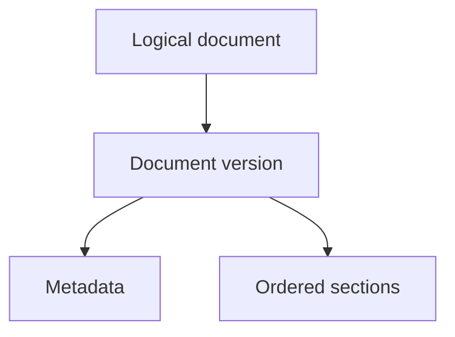
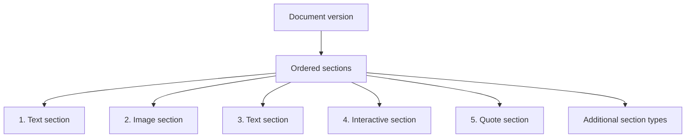
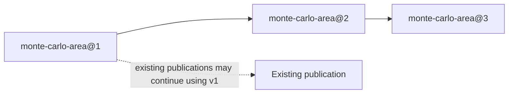
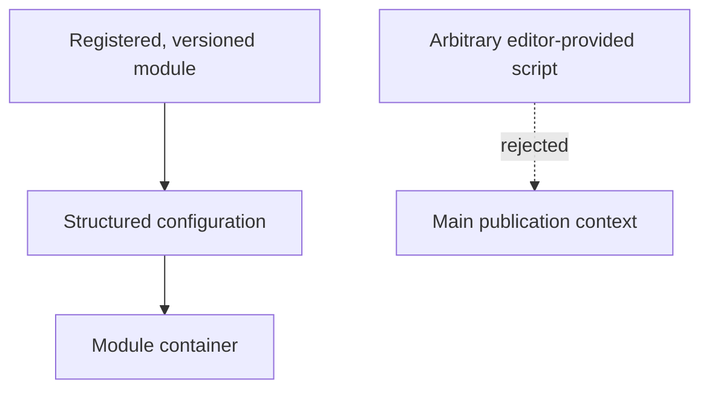
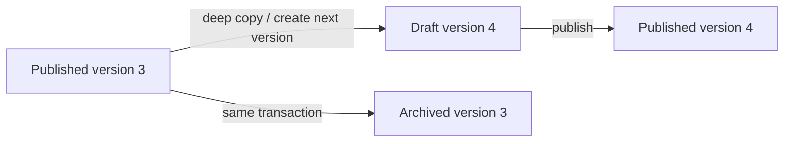
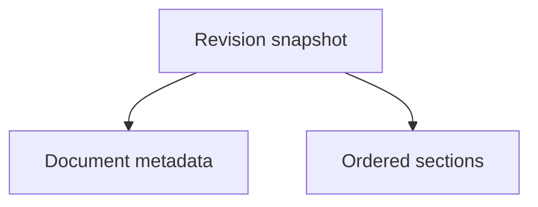

# Verso — Content Model

## Scope

This document defines canonical publication content: document versions, typed
sections, assets, interactive modules, and recoverable revisions. It does not
define how content is rendered, edited over HTTP, authorized, or exposed
through MCP.

Related: [system architecture](system.md), [rendering and cache](rendering.md), [web editor and preview](editor.md), and [identity and MCP](identity-and-mcp.md).

## 1. Content Model

### 1.1 Document

The primary publication unit is a logical `Document`. Its content is published
as a sequence of explicitly numbered `DocumentVersion` objects. The logical
document provides stable identity and lineage; a version owns the metadata,
sections, and nested content that are rendered.

An article is one possible document type.

Conceptually:



Logical document metadata may include:

```text
id
type

status (derived from the current version)

created_at
created_by
```

Version-owned metadata may include:

```text
version_id
version_number
based_on_version_id
state
slug
title
description
updated_at
updated_by
published_at
archive_accessible
```

Possible version states include:

```text
draft
review
scheduled
published
archived
```

There may be at most one published version for a logical document. The
published version is the version resolved by the ordinary public document
route. A document with no published version may still have draft or review
versions, but those versions remain private.

`archive_accessible` controls whether an archived version is available through
ordinary public historical-version routes. It defaults to true when a version
is archived, so historical publications remain readable unless the author
explicitly hides that version. Hiding an archive is a visibility change, not a
content edit. Authorized editorial users may still inspect hidden versions for
management and recovery, in read-only mode.

Document-type-specific fields may be stored separately or as structured metadata.

A version of an article may additionally contain:

```text
authors
subjects
series
series_position
```

---

## 2. Section-Based Content

Verso does not treat the entire document as one monolithic Markdown body.

Instead:



A section has a common structure such as:

```text
id
version_id
position
kind
data
```

The `data` field contains type-specific structured content.

---

## 3. Text Sections

Text sections contain Markdown.

For example:

```json
{
  "markdown": "Let $K/\\mathbb{Q}$ be a number field..."
}
```

A text section may contain:

* paragraphs;
* headings;
* lists;
* equations;
* citations;
* footnotes;
* code;
* links;
* inline images where appropriate.

Verso should avoid turning every paragraph or equation into a separate database object.

A text section should remain a reasonably large semantic unit.

---

## 4. Image Sections

An image section references an asset rather than embedding image bytes in SQLite.

Example:

```json
{
  "asset_id": "01K...",
  "alt": "Prime decomposition diagram",
  "caption": "Decomposition of a rational prime",
  "display": "wide"
}
```

The corresponding binary object lives in the configured asset store.

---

## 5. Interactive Sections

Interactive sections should reference controlled, versioned interactive modules.

Example:

```json
{
  "module": "monte-carlo-area",
  "version": 2,
  "config": {
    "samples": 5000,
    "show_grid": true
  }
}
```

The module may consist of:

```text
JavaScript
CSS
WASM
static assets
```

The module is stored as an asset or collection of assets and referenced from SQLite.

---

## 6. Interactive Module Versioning

Interactive modules should be immutable once published.

For example:



An existing publication may continue using version 1 even after later versions are introduced.

This prevents changes to an interactive implementation from silently modifying old publications.

---

## 7. Arbitrary Script Execution

Verso should not execute arbitrary editor-provided JavaScript directly in the main publication context.

The preferred model is:



If arbitrary HTML/CSS/JavaScript documents are supported later, they should execute inside a sandboxed iframe with an intentionally restrictive capability model.

---

## 8. Asset Storage

Binary assets are stored separately from SQLite.

The initial implementation should support:

```text
local filesystem
```

The architecture may later support:

```text
S3-compatible object storage
RustFS
```

Typical assets include:

```text
images
PDFs
datasets
downloads
JavaScript bundles
WASM modules
stylesheets
```

SQLite stores asset metadata such as:

```text
id
object key/path
content type
size
checksum
created_at
uploaded_by
```

---

## 9. Strict Publication Versioning

Publication versions are immutable. Once a version is published, no operation
may change its publication content or identity: this includes metadata,
sections, nested objects, asset references, and interactive-module
configuration. A published version is never edited in place, and an archived
version is never edited in place. The deliberately mutable
`archive_accessible` field is an access-control exception; changing it does
not change the version's content or publication identity.

To edit a published document, an application service must create the next
version explicitly from the currently published version:



The new draft must record its relationship to the source version, including
the logical document identity, `based_on_version_id`, and the next
`version_number`. It must be explicitly marked as the next version rather than
being an unrelated new document. Only that draft lineage may replace the
currently published version.

In the initial design, the source for `create_next_version` must be the
logical document's current published version. An unpublished `draft`,
`review`, or `scheduled` version may not be used as the parent of another
version. Working revisions and browser recovery snapshots do not create a
new version lineage and cannot be used as parents either.

If another next-version draft is published first, any competing draft based on
the older published version becomes stale and cannot replace the new current
version. It may be retained for review or discarded, but publishing its
content requires creating a new next-version draft from the current published
version.

Future versions may support preserving unpublished work as an explicit draft
snapshot, archiving an abandoned draft before starting another draft from the
same published parent, or rebasing draft changes onto a newer published
version. These are deliberately outside the current model. Until such
operations exist, an unpublished draft must be continued, discarded, or
manually recreated from the current published version; it cannot be forked by
Verso.

Creating the next version is a deep copy at the domain level. Every section
and every nested structured object owned by the source version is copied into
the new version with independent ownership and identifiers. Subsequent edits
to the draft therefore cannot mutate the published or archived source.
Immutable referenced assets and interactive-module versions may be shared by
reference; their references are copied into the new version and the referenced
objects themselves remain immutable. Physical copy-on-write storage is an
acceptable optimization if it preserves this same logical deep-copy contract:
the source version must remain independently readable and immutable, and the
first write to shared data must detach it from the source without observable
cross-version mutation.

Publishing a next version is one application transaction. It validates the
draft, checks authorization and optimistic concurrency, verifies that
`based_on_version_id` is still the current published version, publishes the
draft, and archives the formerly published version. The old version remains stored
as a read-only historical version; the new version becomes the sole version
resolved by the ordinary public route. A failed publication must leave both
versions and the current publication pointer unchanged.

Archived versions are historical publication records, not editable drafts.
They may be rendered and accessed read-only when `archive_accessible` is true.
An author or authorized manager may set that field to false to make a specific
archive inaccessible through ordinary public access. Archive visibility must
not be implemented by deleting the version, overwriting it, or changing its
content.

## 10. Revisions

Draft editing should have recoverable revision history, while publication
versions provide the durable history of what was published. These are related
but distinct concepts:

* a **document version** is an explicitly numbered publication lineage item;
* a **working revision** is an optional immutable snapshot or checkpoint of a
  draft version while it is being edited.

The current draft may remain normalized in:

```text
document_versions
sections
```

while working revisions contain immutable snapshots associated with a draft
version. Published and archived versions must be reconstructible without
depending on mutable draft tables.

Conceptually:



Revision metadata may include:

```text
id
version_id
revision_number
snapshot
created_by
created_at
reason
```

---

## 11. Revision Policy

Working revisions may be created:

* on explicit save;
* on submission for review;
* on publication;
* at configurable server-side draft autosave checkpoints.

Not every keystroke should produce a permanent working revision, and creating
a working revision never changes a published or archived version.

Browser recovery snapshots are not revisions. They remain local, noncanonical
draft state until an editor explicitly restores and saves them to Verso. Local
recovery autosave and server-side draft autosave are separate mechanisms.

---
