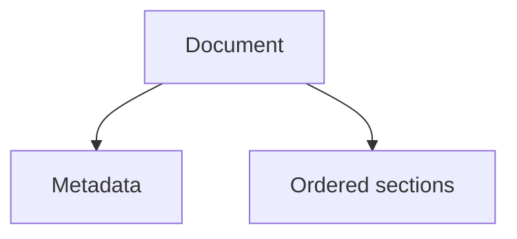
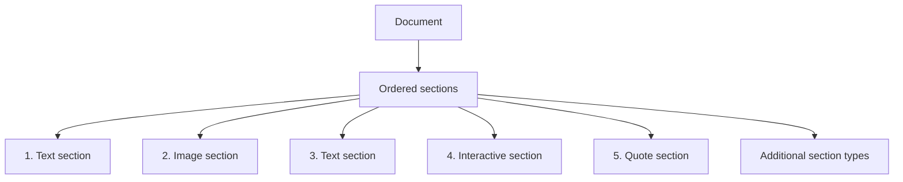
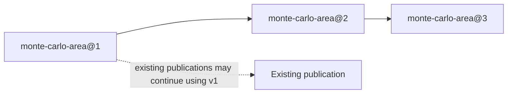
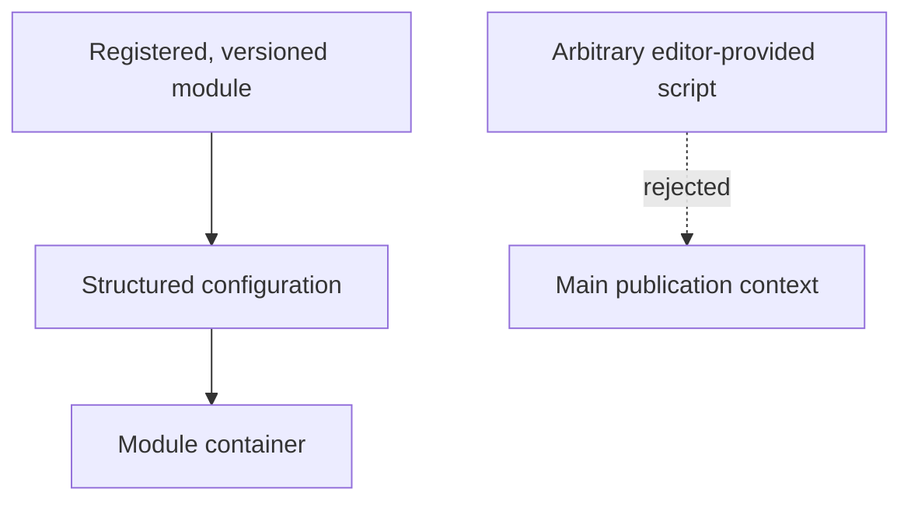
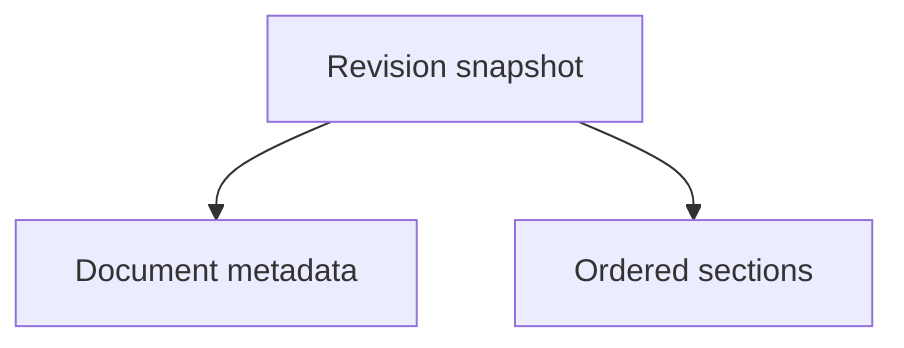

# Verso — Content Model

## Scope

This document defines canonical publication content: documents, typed sections, assets, interactive modules, and recoverable revisions. It does not define how content is rendered, edited over HTTP, authorized, or exposed through MCP.

Related: [system architecture](system.md), [rendering and cache](rendering.md), [web editor and preview](editor.md), and [identity and MCP](identity-and-mcp.md).

## 1. Content Model

### 1.1 Document

The primary publication unit is a `Document`.

An article is one possible document type.

Conceptually:



Common document metadata may include:

```text
id
type
slug
title
description

status

created_at
updated_at
published_at

created_by
updated_by
```

Possible statuses include:

```text
draft
review
scheduled
published
archived
```

Document-type-specific fields may be stored separately or as structured metadata.

An article may additionally contain:

```text
authors
subjects
series
series_position
```

---

## 2. Section-Based Content

Verso does not treat the entire document as one monolithic Markdown body.

Instead:



A section has a common structure such as:

```text
id
document_id
position
kind
data
```

The `data` field contains type-specific structured content.

---

## 3. Text Sections

Text sections contain Markdown.

For example:

```json
{
  "markdown": "Let $K/\\mathbb{Q}$ be a number field..."
}
```

A text section may contain:

* paragraphs;
* headings;
* lists;
* equations;
* citations;
* footnotes;
* code;
* links;
* inline images where appropriate.

Verso should avoid turning every paragraph or equation into a separate database object.

A text section should remain a reasonably large semantic unit.

---

## 4. Image Sections

An image section references an asset rather than embedding image bytes in SQLite.

Example:

```json
{
  "asset_id": "01K...",
  "alt": "Prime decomposition diagram",
  "caption": "Decomposition of a rational prime",
  "display": "wide"
}
```

The corresponding binary object lives in the configured asset store.

---

## 5. Interactive Sections

Interactive sections should reference controlled, versioned interactive modules.

Example:

```json
{
  "module": "monte-carlo-area",
  "version": 2,
  "config": {
    "samples": 5000,
    "show_grid": true
  }
}
```

The module may consist of:

```text
JavaScript
CSS
WASM
static assets
```

The module is stored as an asset or collection of assets and referenced from SQLite.

---

## 6. Interactive Module Versioning

Interactive modules should be immutable once published.

For example:



An existing publication may continue using version 1 even after later versions are introduced.

This prevents changes to an interactive implementation from silently modifying old publications.

---

## 7. Arbitrary Script Execution

Verso should not execute arbitrary editor-provided JavaScript directly in the main publication context.

The preferred model is:



If arbitrary HTML/CSS/JavaScript documents are supported later, they should execute inside a sandboxed iframe with an intentionally restrictive capability model.

---

## 8. Asset Storage

Binary assets are stored separately from SQLite.

The initial implementation should support:

```text
local filesystem
```

The architecture may later support:

```text
S3-compatible object storage
RustFS
```

Typical assets include:

```text
images
PDFs
datasets
downloads
JavaScript bundles
WASM modules
stylesheets
```

SQLite stores asset metadata such as:

```text
id
object key/path
content type
size
checksum
created_at
uploaded_by
```

---

## 9. Revisions

Published and editorial content should have recoverable revision history.

Current document state may remain normalized in:

```text
documents
sections
```

while revisions contain immutable document snapshots.

Conceptually:



Revision metadata may include:

```text
id
document_id
revision_number
snapshot
created_by
created_at
reason
```

---

## 10. Revision Policy

Revisions may be created:

* on explicit save;
* on submission for review;
* on publication;
* at configurable server-side draft autosave checkpoints.

Not every keystroke should produce a permanent revision.

Browser recovery snapshots are not revisions. They remain local, noncanonical
draft state until an editor explicitly restores and saves them to Verso. Local
recovery autosave and server-side draft autosave are separate mechanisms.

---
