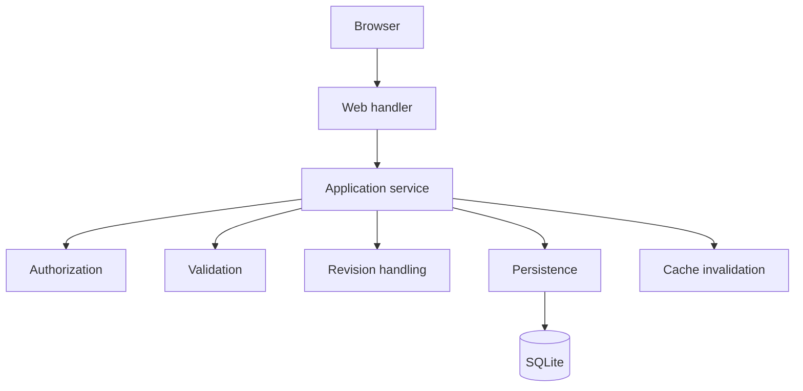
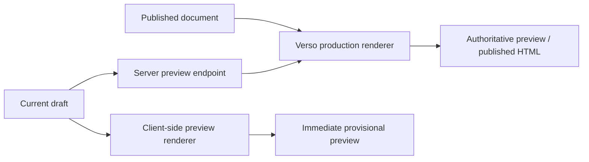
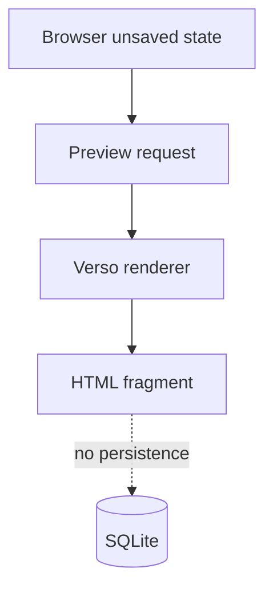
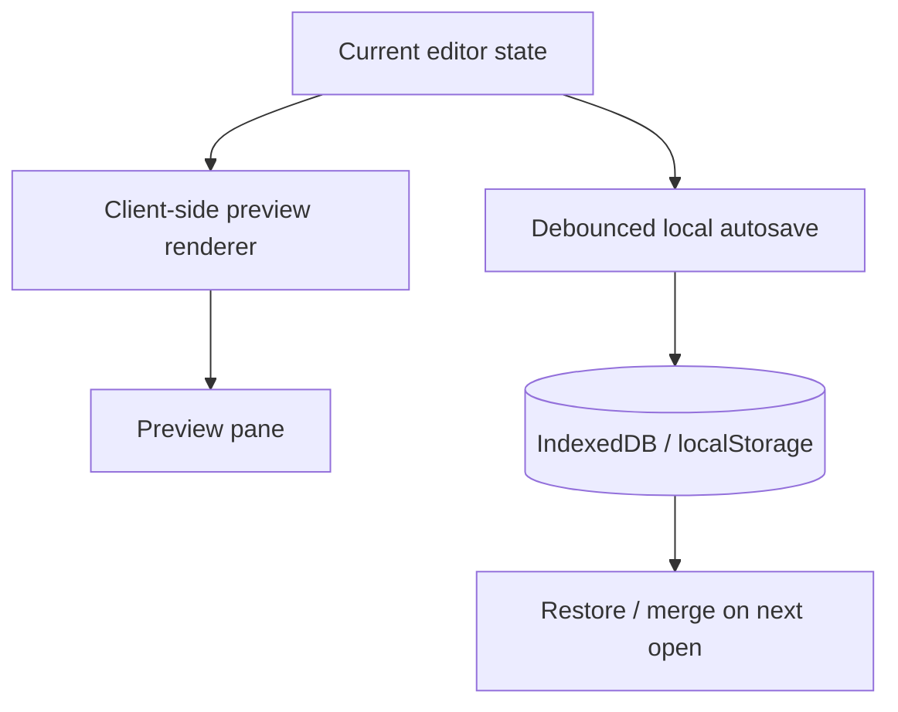
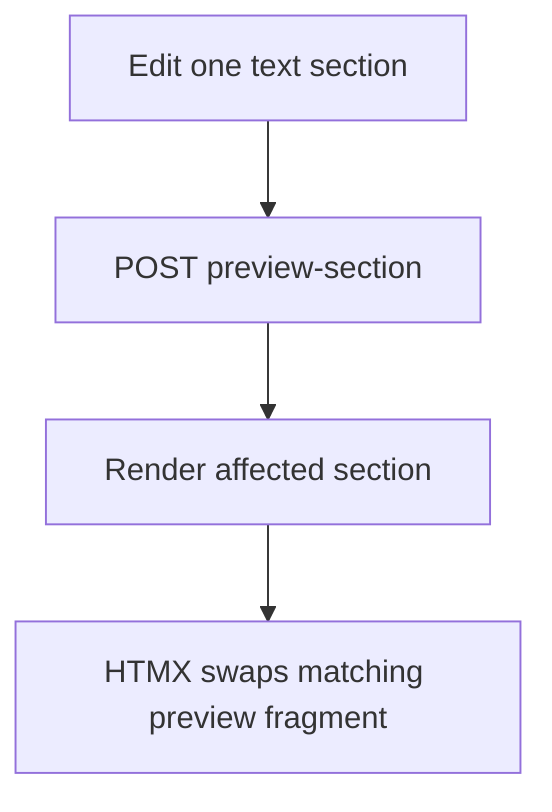
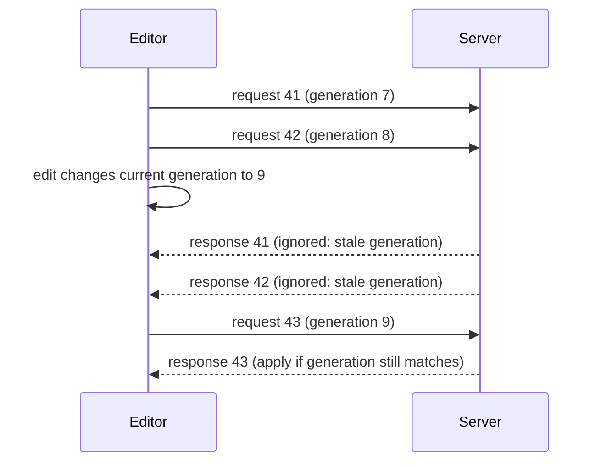

# Verso — Web Editor and Preview

## Scope

This document defines the browser-based editorial interface and unsaved preview lifecycle. It owns section-oriented editing, HTMX interactions, server-rendered previews, partial rendering, and stale-response protection; it does not define public caching, document persistence, or authorization policy.

Related: [content model](content.md), [rendering and cache](rendering.md), [identity and MCP](identity-and-mcp.md), and [operations and boundaries](operations.md).

## 1. Web Editor

Verso provides a browser-based editorial interface.

The initial editor uses:

```text
HTML
+
HTMX 4
+
minimal JavaScript
```

A full SPA framework should not be required unless a concrete feature later justifies it.

The editor operates through normal Verso application services.



---

## 2. Section-Oriented Editor

The editor represents documents as ordered sections.

Example:

```text
┌──────────────────────────────────┐
│ Article title                    │
├──────────────────────────────────┤
│ ≡ Text                           │
│   [Markdown editor............]  │
├──────────────────────────────────┤
│ ≡ Image                          │
│   [diagram.png]                  │
├──────────────────────────────────┤
│ ≡ Interactive                    │
│   Monte Carlo Area               │
├──────────────────────────────────┤
│                                  │
│          + Add section           │
└──────────────────────────────────┘
```

Sections may be:

* inserted;
* edited;
* reordered;
* duplicated;
* removed.

---

## 3. Live Side Preview

The editor should support an optional live preview pane. The pane may be
updated immediately by a client-side renderer and refined by a server-rendered
response.

Example:

```text
┌────────────────────────────┬────────────────────────────┐
│ Editor                     │ Preview                    │
│                            │                            │
│ Text / sections            │ Production-equivalent     │
│                            │ rendered document          │
│                            │                            │
└────────────────────────────┴────────────────────────────┘
```

The Verso server remains authoritative for publication-equivalent output. A
client-side preview is a provisional rendering of the current draft and is
used for responsiveness, offline editing, and recovery from interrupted work.

This guarantees:



The client-side renderer should use the same document model and compatible
Markdown and section semantics as the server. Features that require document
context or are not supported locally should fall back to a server preview.

---

## 4. Preview Is Not Save

Preview operations should not automatically mutate SQLite.

The editor may send the proposed unsaved state directly to the rendering service.

Conceptually:



No database write is required.

The browser may persist a recovery snapshot without turning the preview into a
Verso draft. Browser persistence and server persistence are separate
operations.

The following operations remain distinct:

```text
render preview
render local preview
autosave local draft
save draft / server-side autosave checkpoint
publish
```

Only server-side `save draft` (including an optional server-side draft autosave
checkpoint) and `publish` mutate canonical Verso state. Local recovery autosave
does not create a Verso revision or mutate SQLite.

---

## 5. Local Draft Recovery and Client-Side Preview

The editor should autosave the current structured document locally so a tab
crash, browser restart, connectivity loss, or interrupted editing session does
not discard work. Local autosave is a recovery mechanism, not a replacement
for saving to Verso. Client-side preview improves responsiveness; local
autosave provides recovery from interrupted work.

IndexedDB is preferred for complete document snapshots and larger drafts.
`localStorage` may be used as a fallback for small documents and recovery
metadata. Another browser-provided durable store may be used if it offers
better capacity or lifecycle guarantees.

A local snapshot should include at least:

```text
site/deployment namespace
account identity, when authenticated
stable client-generated draft identity
server document identity, when known
base server revision, if known
draft content
schema version
updated_at
```

The storage key should be the tuple `{site_namespace, owner_scope, draft_id}`.
`draft_id` is generated by the client when a new document is started and stays
stable until the local snapshot is discarded. After the first successful save,
the snapshot records the mapping from `draft_id` to the server `document_id`;
subsequent recovery can use either identity without replacing the stable draft
key. This prevents drafts for different documents from colliding and keeps new
documents recoverable before they have a server identity.

Recovery must never cross user, site, or permission boundaries. On sign-out or
account switching, the editor must stop exposing the previous account's
snapshots before loading the next account's namespace. Anonymous snapshots must
not be silently re-associated with an authenticated account; importing one
requires an explicit user action and ownership decision.

Autosave should be debounced during editing and also attempted at appropriate
page-lifecycle checkpoints. Storage failures must not prevent editing; the UI
should expose whether recovery data is being persisted.

When opening a document, the editor should compare the local snapshot with the
server draft. If the local snapshot is newer or diverges, the editor should
offer explicit restore, merge, or discard actions. A successful server save or
publish should advance the local base revision or clear the obsolete snapshot.

The local recovery path and client-side renderer share the same current draft:



Local snapshots are origin-scoped, noncanonical, and user-visible. They must
not be exposed through public routes or treated as authoritative publication
state.

---

## 6. Partial Preview Rendering

For ordinary text editing, Verso should avoid re-rendering the entire document unnecessarily.

Example:



Possible behavior:

```text
text edit
    → render affected section

image caption change
    → render image section

section reorder
    → render document body

global metadata change
    → render affected page/header region

citation-numbering change
    → full document render if needed
```

This keeps preview operations lightweight.

---

## 7. HTMX Preview Requests

A text section may conceptually use:

```html
<textarea
  hx-post="/admin/preview/section"
  hx-trigger="input changed delay:250ms"
  hx-target="#preview-section-id">
</textarea>
```

The server returns production-equivalent HTML.

A debounce around approximately 150–300 ms is appropriate for text editing.

Exact behavior may be configurable.

---

## 8. Optimistic Preview Behavior

The editor may provide lightweight client-side optimistic updates and
client-side document previews.

Examples include:

```text
title text
caption text
alt text
visibility
layout selection
editor UI state
```

The authoritative rendered preview remains server-generated. The client-side
preview may lead while the server request is pending, but a server response
must be able to replace it when the local renderer lacks context or produces a
different result.

Verso should avoid unrelated, competing Markdown rendering rules in the
browser and server. A shared grammar, generated compatibility layer, or
explicitly documented supported subset should be used instead.

---

## 9. Avoiding Stale Preview Responses

Rapid typing may result in multiple overlapping preview requests.

Verso must prevent older responses from overwriting newer preview state. A
preview response must only be applied if both its request sequence and its
draft generation or content hash still match the current editor state. An edit
made after a request was sent therefore makes that response stale, even if it
has the newest response sequence so far.

Possible strategies include:

* aborting obsolete requests;
* assigning monotonically increasing preview sequence numbers;
* including a draft generation or content hash in each request and response;
* rejecting or ignoring responses whose sequence or draft fingerprint is stale.

Conceptually:



---

## 10. Full-Document Preview

Some features require document context:

* citations;
* footnotes;
* cross-references;
* numbering;
* table of contents;
* section references.

For these cases, the browser may send the full current unsaved document state to a preview endpoint.

Verso constructs an in-memory `Document`, renders it, and returns the result.

This operation still does not imply persistence.

---
