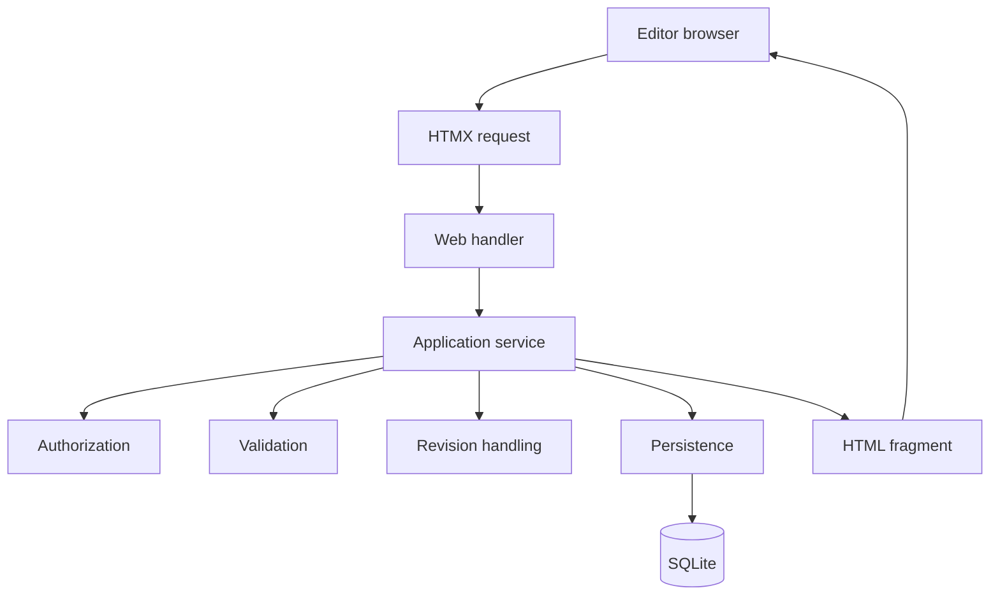
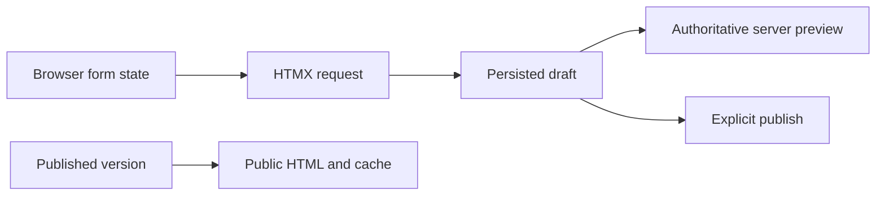

# Verso — Web Editor and Preview

## Scope

This document defines the initial server-transactional editorial interface.
It covers section-oriented editing, HTMX fragment updates, persisted-draft
previews, and the boundary between editorial state and publication state. A
deferred browser-local editor alternative is documented separately in
[editor architecture alternatives](editor-approaches.md).

Related: [content model](content.md), [rendering and cache](rendering.md),
[identity and MCP](identity-and-mcp.md), and [operations and boundaries](operations.md).

## 1. Web editor

The initial editor is an HTMX-oriented, server-rendered interface. HTMX is
used for progressive fragment updates; it is not an application-owned client
document model and does not replace application services.

```text
HTML forms and server-rendered fragments
+
HTMX 4 for requests and swaps
+
Verso application services for every mutation
```

The server owns the working draft. HTMX must not swap across a boundary that
would bypass authorization, validation, revision checks, or application-level
cache invalidation.

The editor operates through the same application services used by other
interfaces:



### Form placement

The editor keeps the document surface visible while fields are edited. Title,
document details, and section fields are disclosed inline, with compact action
controls beside the content they operate on. This preserves the document-like
interaction of the editor while each confirmation still submits an explicit
server mutation. A form may occupy the full page when the page itself is
dedicated to that operation, such as account setup or password recovery.

## 2. Section-oriented editing

Documents are edited as ordered, typed sections. Sectioning is a content-model
boundary rather than an offline-storage requirement. It provides stable
identities for validation, rendering, insertion, reordering, duplication,
deletion, asset ownership, and AI/MCP operations.

Each section is rendered as an ordinary article region. An explicit action
opens its editable fields or submits a section operation. The server returns
the updated section or the smallest surrounding region needed to preserve
ordering, controls, validation errors, and accessible focus.

Supported operations include:

- insert a section;
- edit section fields;
- reorder sections;
- duplicate a section;
- remove a section;
- validate and preview a persisted section or draft.

For a published or archived version, the editor is read-only. Editing a
published version first creates the next-version draft through the application
service. Published and archived versions remain immutable.

## 3. Request and mutation model

The initial editor uses explicit server requests rather than saving every
keystroke. A typical section operation is:

1. Render the current draft and section controls.
2. Submit an HTML form or HTMX request for one validated operation.
3. Authenticate and authorize the request.
4. Validate the payload and expected revision.
5. Persist the mutation atomically through the application service.
6. Return the updated HTML fragment and the new revision information.
7. Show a stale-revision error without overwriting newer work.

Section-level operations keep requests focused while preserving the aggregate
draft and optimistic-concurrency rules in the application layer. A complete
draft save may be used where an operation spans several sections, but the web
handler must still delegate validation, authorization, persistence, and
invalidation to the shared service.

## 4. Preview and save

Preview, save, and publish remain distinct operations.

The initial editor does not promise a browser-local preview of unsaved content.
An editor saves a draft or section operation first, then requests a preview of
the persisted draft. This keeps the server renderer as the only publication
and editorial-preview authority and avoids a second Markdown implementation in
the browser.

An explicit draft preview:

- is available only after editorial authorization;
- loads the persisted draft through the application layer;
- uses the same validation, safe rendering, template, and asset-resolution
  path as publication;
- returns `Cache-Control: private, no-store`;
- never enters the public filesystem cache;
- does not mutate the draft or publish it.

If a mutation fails validation or rendering, the response contains an
actionable error and canonical state remains unchanged.

## 5. State boundaries

The initial editor has four relevant kinds of state:



- **Canonical state:** persisted drafts and published versions in SQLite,
  together with their authorized assets.
- **Derived state:** rendered HTML and filesystem page-cache entries.
- **Ephemeral state:** form fields before submission, pending HTMX requests,
  response fragments, and preview request buffers.
- **Deferred state:** browser-local recovery snapshots and offline working
  documents are not part of the initial editor.

Unsaved browser form state must not be treated as canonical, published, or
publicly addressable. A failed request must leave the previous canonical draft
intact and must allow the editor to retry or discard the local form values.

## 6. Failure and concurrency behavior

- A failed validation returns the form with field-level errors.
- A failed authorization check does not expose draft content.
- A stale expected revision fails instead of overwriting a newer mutation.
- A failed preview does not change the draft or its public cache.
- A lost connection may lose changes that were not successfully submitted; the
  initial editor does not promise offline editing or browser-local recovery.

Later browser-local recovery can be added as a separate enhancement if actual
editorial use justifies it, without changing canonical storage or the server
renderer.
