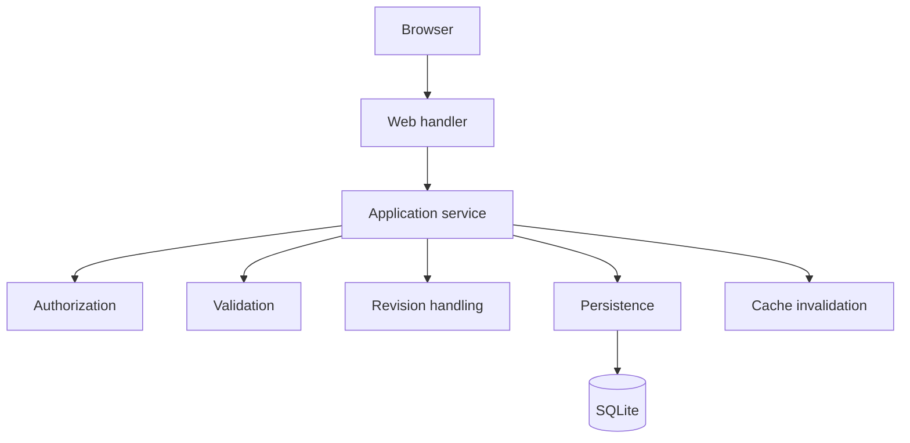
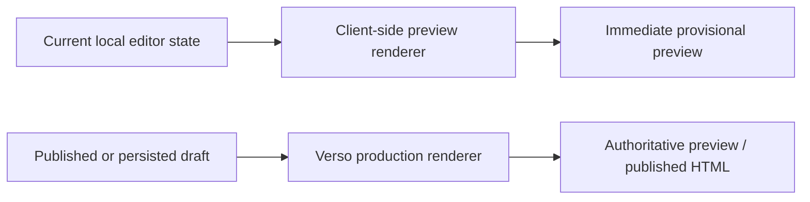
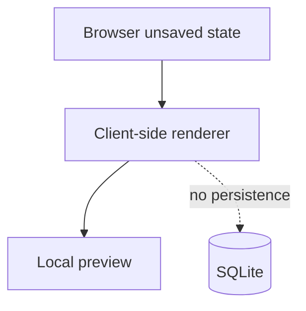
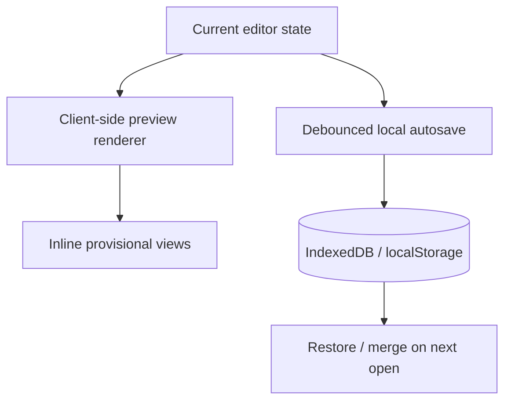

# Verso — Web Editor and Preview

## Scope

This document defines the browser-based editorial interface and preview
lifecycle. It owns section-oriented editing, client-side unsaved previews,
explicit server previews of persisted drafts, and stale local-render
protection; it does not define public caching, document persistence, or
authorization policy.

Related: [content model](content.md), [rendering and cache](rendering.md), [identity and MCP](identity-and-mcp.md), and [operations and boundaries](operations.md).

## 1. Web Editor

Verso provides a browser-based editorial interface.

The initial editor uses:

```text
HTML
+
HTMX 4
+
minimal JavaScript
```

A full SPA framework should not be required unless a concrete feature later justifies it.

The editor operates through normal Verso application services.



---

## 2. Section-Oriented Editor

The editor represents documents as ordered sections.

Each section has two browser-local presentation modes:

* `edit`, where its fields and section controls are visible;
* `preview`, where the validated section is rendered as part of the article
  flow and an `Edit` action is available from its contextual toolbar.

The editor presents the draft as an article rather than a stack of framed
section cards. Preview output contains only the section content. Reordering,
duplication, deletion, and edit/validate actions are icon-only controls in the
section's upper corner; they appear on hover or keyboard focus. Clicking a
section activates its toolbar until another section is activated, which keeps
the controls usable on touch devices. Every icon has an accessible label and a
native tooltip.

The document title is the primary heading of the article. It is edited inline
as a content-editable heading and is made non-editable after the local
validation action. Slug and description remain available from the compact
document-details control without adding a separate metadata card to the
article surface.

New sections start in `edit` mode. The editor explicitly validates a section
with its check action before switching it to `preview` mode. A failed
validation keeps the section in `edit` mode and displays an inline error.
Returning to `edit` mode never changes the canonical document because the
entire workflow is still browser-local.

The title follows the same two-mode treatment. Slug and description are
editable from the compact document-details control. Reordering, duplication,
and deletion controls remain available from the section toolbar in either
mode.

Example:

```text
Article title                                      [document details]

Rendered Markdown                           [move · copy · delete · edit]

Image placeholder + caption                 [move · copy · delete · edit]

                                                   [add]
```

Sections may be:

* inserted;
* edited;
* reordered;
* duplicated;
* removed.

These operations apply only to a draft version. Opening a published or
archived version is read-only. An editor who chooses to edit a published
version must explicitly create the next version; Verso deep-copies the source
version's sections and owned nested objects into that draft and records the
source as `based_on_version_id`. The editor then edits the new draft without
changing the source version.

---

## 3. Inline Local Preview

The editor does not need a separate side preview pane. Unsaved state is
rendered inline, section by section, by the browser client-side renderer; the
browser does not send unsaved document content to a Verso preview endpoint.

Example:

```text
Article title

Rendered Markdown                          [move · copy · delete · edit]

[asset] [alt text] [caption]                [move · copy · delete · validate]
```

The Verso server remains authoritative for publication-equivalent output. A
client-side preview is a provisional rendering of current local state and is
used for responsiveness, offline editing, and recovery from interrupted work.

This guarantees:



The client-side renderer should use the same document model and compatible
Markdown and section semantics as the server. Features requiring document
context are unavailable in an unsaved inline preview; after an explicit save,
the editor may request a server preview of that persisted draft.

The initial browser-local subset renders headings, paragraphs, line breaks,
emphasis, strong text, inline code, fenced code, block quotes, ordered and
unordered lists, and links or images with an allowed `http`, `https`,
`mailto`, relative, or fragment URL. Raw HTML and unsupported URL schemes are
escaped as text. Image sections remain placeholders until the asset workflow
exists; the local preview does not resolve `assets://` references.

Before inserting local preview output into the editor DOM, the client renderer
must apply the same no-raw-HTML profile and safe URL rules as the server
renderer. This protects the editor experience, but the server independently
validates and safely renders every persisted draft; it never trusts client-side
sanitization as a publication security boundary.

---

## 4. Preview Is Not Save

Client-side preview never mutates SQLite and never sends the current unsaved
document state to Verso. The browser may persist a recovery snapshot without
turning the preview into a Verso draft. Browser persistence and server
persistence are separate operations. Switching a section or metadata field
between `edit` and `preview` is presentation state only; it is not a save,
validation of canonical state, or publication operation.

Conceptually:



The following operations remain distinct:

```text
render local preview
autosave local draft
save draft / server-side autosave checkpoint
render explicit server preview of persisted draft
publish
```

Only server-side `save draft` (including an optional server-side draft autosave
checkpoint) and `publish` mutate canonical Verso state. Local recovery autosave
does not create a Verso revision or mutate SQLite.

For a published document, `save draft` means saving the explicitly created
next-version draft. It never means modifying the published version.

---

### 4.1 Explicit server preview

An editor may explicitly request a preview link for a persisted draft. This
link is an authenticated editorial route, not a shareable bearer link. Verso
loads the persisted draft after authorization and runs the exact same server
validation, safe rendering, template, asset-resolution, and response-header
path as publication. It differs only in that it is private, uses
`Cache-Control: private, no-store`, does not enter the public filesystem cache,
and does not change canonical draft state.

The server preview renderer must not fetch arbitrary network URLs. Previewable
assets resolve only through the authorized asset store, and any future embed
provider requires a separate, allowlisted server-side integration. Rendering
uses configured request-concurrency and execution-time limits; a limit or
rendering failure returns an error without changing the draft.

---

## 5. Local Draft Recovery and Client-Side Preview

The editor should autosave the current structured document locally so a tab
crash, browser restart, connectivity loss, or interrupted editing session does
not discard work. Local autosave is a recovery mechanism, not a replacement
for saving to Verso. Client-side preview improves responsiveness; local
autosave provides recovery from interrupted work.

IndexedDB is preferred for complete document snapshots and larger drafts.
`localStorage` may be used as a fallback for small documents and recovery
metadata. Another browser-provided durable store may be used if it offers
better capacity or lifecycle guarantees.

A local snapshot should include at least:

```text
site/deployment namespace
account identity, when authenticated
stable client-generated draft identity
server document identity, when known
base server version and working revision, if known
draft content
schema version
updated_at
```

The storage key should be the tuple `{site_namespace, owner_scope, draft_id}`.
`draft_id` is generated by the client when a new document is started and stays
stable until the local snapshot is discarded. After the first successful save,
the snapshot records the mapping from `draft_id` to the server `document_id`;
subsequent recovery can use either identity without replacing the stable draft
key. This prevents drafts for different documents from colliding and keeps new
documents recoverable before they have a server identity.

Recovery must never cross user, site, or permission boundaries. On sign-out or
account switching, the editor must stop exposing the previous account's
snapshots before loading the next account's namespace. Anonymous snapshots must
not be silently re-associated with an authenticated account; importing one
requires an explicit user action and ownership decision.

Autosave should be debounced during editing and also attempted at appropriate
page-lifecycle checkpoints. Storage failures must not prevent editing; the UI
should expose whether recovery data is being persisted.

When opening a document, the editor should compare the local snapshot with the
server draft. If the local snapshot is newer or diverges, the editor should
offer explicit restore, merge, or discard actions. A successful server save or
publish should advance the local base version and working revision or clear the
obsolete snapshot. A local snapshot based on a published version must not be
silently applied to a different next-version lineage.

The local recovery path and client-side renderer share the same current draft:



Local snapshots are origin-scoped, noncanonical, and user-visible. They must
not be exposed through public routes or treated as authoritative publication
state.

---

## 6. Client-side Preview Behavior

The editor may provide lightweight client-side optimistic updates and
client-side document previews.

Examples include:

```text
title text
caption text
alt text
visibility
layout selection
editor UI state
```

The client-side preview is the only live preview of unsaved content. It renders
the currently validated section inline where local semantics permit, and must
rerender document-wide context when numbering, citations, footnotes,
cross-references, or the table of contents can change. The editor must clearly
label each rendered view as provisional. A server-rendered explicit preview
becomes available after saving the draft.

Verso should avoid unrelated, competing Markdown rendering rules in the
browser and server. A shared grammar, generated compatibility layer, or
explicitly documented supported subset should be used instead. The browser
must apply its own stale-work protection when rendering asynchronously, so an
older local render cannot replace a newer editor generation.

---
