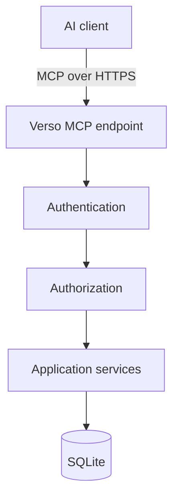
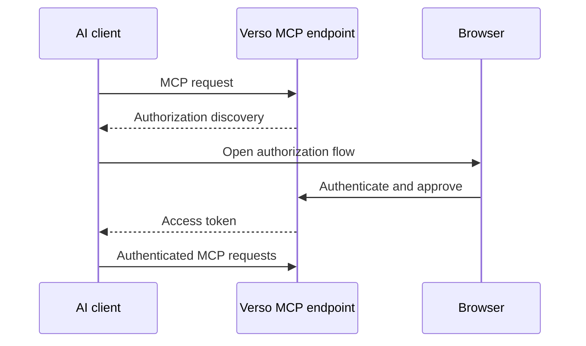

# Verso — Identity and MCP

## Scope

This document defines the unified user identity, capability authorization, and remote MCP boundary. It owns OAuth-compatible MCP access, semantic tool design, AI edit granularity, and optimistic concurrency; it does not define document structure or rendering.

Related: [system architecture](system.md), [content model](content.md), [web editor and preview](editor.md), and [operations and boundaries](operations.md).

## 1. Authentication

Verso has one unified user identity model.

The same identity system is used for:

* web editing;
* MCP;
* future APIs.

Possible roles include:

```text
owner
manager
editor
author
contributor
```

Roles are convenience groupings around permissions.

### 1.1 First-user provisioning (planned)

The initial owner is provisioned only while the database contains no row in
`users` and no pending initial-owner claim. The check is against the existence
of any user row, not only active users or users with local credentials. A
disabled user therefore closes the initial setup window. An email-only OIDC
bootstrap claim is not yet a user, but it is a single-use setup lock and also
closes the web, script, and configuration bootstrap paths until it is consumed
or explicitly recovered through an offline/operator procedure; it must not be
recovered through a public browser route.

The planned first-user flow supports three entry points at the same time:

1. **Web registration.** When an unauthenticated request reaches the login
   boundary while no user exists, the login page redirects to a one-time
   registration page. A successful local registration creates the owner and
   immediately establishes a new web session. When OIDC is configured, the
   page may instead start the configured OIDC authorization flow; the callback
   must finish through the same application boundary.
2. **Script provisioning.** `verso auth bootstrap-owner` accepts the initial
   profile, local login, and an Argon2id password hash (or a password supplied
   through a dedicated secret input that is hashed before storage). Plaintext
   passwords must not be accepted as command-line arguments or written to
   logs. The command is intended for operators who want to initialize the
   database before starting the web server.
3. **Configuration provisioning.** An optional bootstrap record in the
   deployment configuration, with equivalent profile and credential fields,
   is applied during startup before the listener is exposed. Its fields may
   be supplied through configuration or environment variables, but are not
   ordinary `serve` command-line overrides. A complete record is explicit
   opt-in; a partial record is a configuration error rather than a reason to
   silently create an incomplete account.

These are adapters, not separate identity systems. Local web registration,
the CLI, and complete configuration records call one application operation,
which starts a write transaction, rechecks that no user or pending claim
exists, creates the owner role and any local credential, records an audit
event, and commits atomically. SQLite serialization makes concurrent web,
script, and startup attempts safe: the first successful transaction wins.
If configuration provisioning is complete, it gets the first opportunity
before the HTTP listener starts; operators should still configure only one
source for a predictable first-run procedure.

The web registration route is available only during this empty-database
window. After the first committed user row, it redirects to login and does
not become a public account-signup route. The script and configuration paths
also recheck the database at the point of mutation and fail closed once a user
or pending claim exists. A later web request maps the already-initialized
result to a login redirect; the CLI reports a non-zero already-initialized
error; configuration startup treats it as an idempotent no-op. No path may
bypass the application service by inserting directly into SQLite.

When OIDC is configured for the instance, script and configuration
provisioning may use an **email-only bootstrap**: the deployment supplies the
display name and email while omitting the local login, password, and provider
subject. Email is only a lookup/claim value, never authentication. The
service must create a singleton `initial_owner_claim` record containing the
normalized target email, display name, and exact configured issuer; it does
not create an active user or grant any capability. The first callback from
that exact issuer may consume the claim only when the OIDC identity has a
verified email whose normalized value exactly matches the configured target.
The activation transaction creates the owner and binds the immutable
issuer-plus-subject identity pair. An arbitrary email from a browser, an
unverified OIDC claim, a different issuer, or a different email must not claim
the account.

The claim and its single-row setup lock require an explicit schema/migration
decision in `IAM-000`. OIDC identities must be stored and constrained as
issuer-plus-subject pairs; a bare provider subject is not globally unique.

Successful local provisioning or pending-claim activation grants the `owner`
role and writes a system audit record. Creating a pending claim grants no role
and cannot authenticate. Bootstrap is not a recovery or account-reset
mechanism; claim recovery and subsequent user creation use an explicit
operator procedure or the normal authenticated flows.

---

## 2. Authorization

The actual authorization model should be capability-oriented.

Possible permissions include:

```text
document:create

document:read:assigned
document:read:any

document:update:assigned
document:update:any
document:assign_editor

document:review
document:publish
document:finalize
document:archive:manage

author:manage

asset:read
asset:upload

interactive:create
interactive:publish

user:manage
```

Application services perform authorization.

Interfaces do not implement their own independent security logic.

An author is an attribution record, not an authorization principal. The initial
role mapping grants `author:manage` and `document:assign_editor` only to
managers. The initial role mapping also grants `document:finalize` only to
managers. A manager creates and maintains authors, chooses a document's listed
authors, and may assign an editor to act for a particular author or document.
An assignment grants `document:read:assigned` and
`document:update:assigned` only within its recorded scope. It does not make an
editor the author, and every mutation records both the actual authenticated
actor and, where applicable, the author for whom the editor acted. Authorship
metadata never grants edit access by itself. Creating or changing a document's
author list requires `author:manage`; an editor may create or update content
for an author only through a manager-created assignment.

Author and assignment mutations are application operations. Author-scoped and
document-scoped assignments are mutually exclusive records, active duplicates
are rejected, revocation checks the expected assignment revision, and each
committed mutation appends an audit row with the authenticated actor and the
affected author or document.

OAuth scopes and application permissions are cumulative restrictions: a tool
operation succeeds only when its required scope and required application
capability both allow the specific resource. For example, `content:write` does
not bypass a missing assigned-editor permission, and an assigned editor cannot
use a token lacking `content:write`.

---

## 3. MCP

MCP is a first-class remote interface for AI-assisted editing.

The initial focus is **online MCP access**.

Local stdio-based editing is outside the initial scope.

Architecture:



MCP must never bypass the application service layer.

---

## 4. MCP Authentication

Remote MCP access uses the OAuth authorization-code flow with PKCE using the
S256 challenge method. The initial MCP endpoint does not accept the implicit,
resource-owner-password, or client-credentials grants. A client must use a
pre-registered exact redirect URI; redirect URI prefixes, wildcards, and
unvalidated dynamic redirects are rejected.

Typical flow:



The resulting identity maps to an ordinary Verso user.

An AI acts with the authority granted to that user and token.

Access tokens are short-lived bearer credentials issued for the Verso MCP
resource. Validation checks their issuer, audience, expiry, subject, client,
and granted scopes. Refresh tokens, when enabled, are stored and compared only
in revocable protected form, rotated on use, and revoked on logout, explicit
revocation, or a security-relevant account change. OAuth consent displays the
client identity and requested scopes; it must not silently expand an existing
grant.

Web-editor sessions use `Secure`, `HttpOnly`, and `SameSite` cookies. Every
unsafe cookie-authenticated web request, including HTMX requests, requires
CSRF protection. CORS is disabled by default and may permit only explicitly
configured origins. A deployment behind a reverse proxy must trust forwarded
host and scheme headers only from configured proxy addresses; public origin
and OAuth redirect construction must not be derived from an arbitrary request
`Host` header.

The initial web login boundary does not accept identity assertions from a
reverse proxy. A reverse proxy may terminate TLS and provide trusted forwarded
origin metadata, but it never authenticates a user for Verso. The local
provider stores only a memory-hard password hash and requires generic
credential failures, failure rate limiting, session rotation after login, and
authenticated password change/recovery flows. Recovery-token delivery is left
to a future configured channel; the application does not expose tokens through
the generic web response.

Verso's planned OIDC integration will also be implemented inside Verso rather
than delegated to an authentication gateway. It will use the authorization-code flow with PKCE,
exact redirect URI validation, state and nonce checks, issuer and audience
validation, signed discovery/JWKS verification, and explicit account linking.
Both providers resolve to the same local user and session services. Login
establishes a host-only session cookie and a readable CSRF cookie, while logout
is POST-only and requires the session's CSRF token.

The transport-neutral session boundary stores only SHA-256 hashes of the opaque
session and CSRF secrets. Owner bootstrap is a one-time application operation:
it creates the first local user with the `owner` role and records a system audit
event. Session creation accepts only an identity subject that an interface has
already verified; it does not treat an arbitrary request value as proof of
identity. Session lookup rejects revoked, expired, or disabled identities, and
logout revokes the current session.

---

## 5. MCP Scopes

OAuth scopes provide another authorization boundary.

Initial scopes may include:

```text
content:read
content:write
content:review
content:publish

assets:read
assets:write
```

A recommended AI grant may include:

```text
content:read
content:write
```

without:

```text
content:publish
```

This allows AI-assisted drafting without allowing unattended publication.

---

## 6. MCP Tool Design

MCP should expose semantic editorial operations rather than raw database access.

Potential tools include:

```text
list_documents
search_documents
get_document

create_document
update_document_metadata
create_next_version
export_document
import_document_archive

list_sections
get_section
insert_section
update_section
move_section
delete_section

create_revision
list_revisions
restore_revision

preview_document

submit_for_review
publish_document
finalize_document
set_archive_visibility

list_assets
get_asset
upload_asset
```

The tool set should remain small, composable, and domain-oriented.

Document and section update tools operate on a draft version identified by its
version identity. `create_next_version` accepts only the current published
version as its source and fails when the document already has a mutable draft
or review version. Attempting to use an unpublished version as the parent
fails. `set_archive_visibility` changes only the read-only archive's
accessibility and requires the archive-management capability.

`preview_document` renders an explicitly selected persisted draft or published
version. It does not accept caller-supplied unsaved content, create a preview
link, or mutate canonical state. `unpublish_document`, scheduling tools, and
server-side previews of unsaved state are outside the initial MCP surface.

`finalize_document` is an explicit manager operation, not a metadata update.
It requires `document:finalize`, expected current state, a published current
version, and no mutable version. It irreversibly closes the document lineage as
defined in the content model.

`export_document` produces the portable document exchange archive described in
the [content model](content.md#9-document-exchange-archives), from the current
published version or an explicitly selected persisted draft. It includes the
complete section tree and required assets. An authorized administrator or
manager may request the optional presentation bundle for matching local
previews. `import_document_archive` validates the archive and either creates a
new local document draft or updates an explicitly selected existing draft. It
must not publish content, reuse source host identities as authoritative local
IDs, create a new draft from an unpublished source draft, or silently
overwrite a concurrent draft update.

Scheduling, unpublishing, preserving an abandoned draft as a version lineage,
and rebasing onto a newer published version are documented future extensions,
not current MCP operations.

---

## 7. AI Editing Granularity

AI editing should normally target individual sections.

For example:

```text
update_section(
    document_id,
    version_id,
    section_id,
    expected_version,
    expected_revision,
    data
)
```

This is preferable to replacing an entire article when only one section is being edited.

Benefits include:

* fewer accidental modifications;
* lower token usage;
* clearer revision history;
* easier concurrency control;
* better conflict handling.

---

## 8. Optimistic Concurrency

Verso should use optimistic concurrency for every mutation of an existing
draft, document assignment, archive-visibility setting, or publication state.
The caller supplies the expected version and working-revision identity, and the
application checks them in the mutation transaction. `create_next_version`
also supplies the expected current published version and atomically checks the
one-mutable-version rule. Creation commands with no existing state use a
caller-provided idempotency key; the service records the result per
authenticated client so a retry cannot create another document, upload, or
assignment. Publishing must also verify atomically that the draft's
`based_on_version_id` is still the logical document's current published
version. A mutation against a published or archived version fails with an
immutable-version error; the caller must create or select the appropriate
draft next version first.

Example:

```text
current revision = 42

AI submits:
expected_revision = 42
```

If the document has become revision 43 in the meantime, the mutation fails
rather than overwriting newer work. Restoring a working revision or historical
publication version creates or updates a draft; it never edits the historical
source. Publishing a next version atomically archives the old published
version and promotes the draft.

The same mechanism applies to human editors. Initial Verso does not implement
unpublish or scheduling; they must not be emulated by directly changing a
version state.

---
