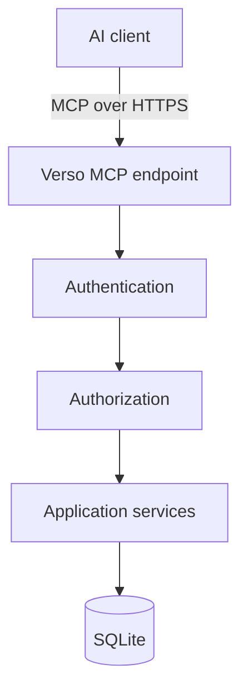
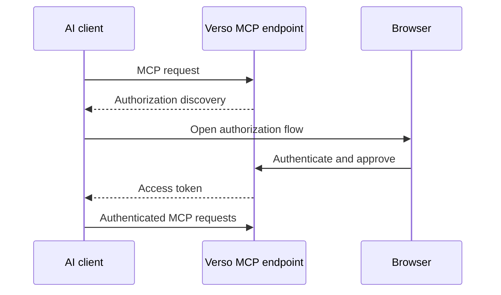

# Verso — Identity and MCP

## Scope

This document defines the unified user identity, capability authorization, and remote MCP boundary. It owns OAuth-compatible MCP access, semantic tool design, AI edit granularity, and optimistic concurrency; it does not define document structure or rendering.

Related: [system architecture](system.md), [content model](content.md), [web editor and preview](editor.md), and [operations and boundaries](operations.md).

## 1. Authentication

Verso has one unified user identity model.

The same identity system is used for:

* web editing;
* MCP;
* future APIs.

Possible roles include:

```text
owner
manager
editor
author
contributor
```

Roles are convenience groupings around permissions.

---

## 2. Authorization

The actual authorization model should be capability-oriented.

Possible permissions include:

```text
document:create

document:read:assigned
document:read:any

document:update:assigned
document:update:any
document:assign_editor

document:review
document:publish
document:finalize
document:archive:manage

author:manage

asset:read
asset:upload

interactive:create
interactive:publish

user:manage
```

Application services perform authorization.

Interfaces do not implement their own independent security logic.

An author is an attribution record, not an authorization principal. The initial
role mapping grants `author:manage` and `document:assign_editor` only to
managers. The initial role mapping also grants `document:finalize` only to
managers. A manager creates and maintains authors, chooses a document's listed
authors, and may assign an editor to act for a particular author or document.
An assignment grants `document:read:assigned` and
`document:update:assigned` only within its recorded scope. It does not make an
editor the author, and every mutation records both the actual authenticated
actor and, where applicable, the author for whom the editor acted. Authorship
metadata never grants edit access by itself. Creating or changing a document's
author list requires `author:manage`; an editor may create or update content
for an author only through a manager-created assignment.

OAuth scopes and application permissions are cumulative restrictions: a tool
operation succeeds only when its required scope and required application
capability both allow the specific resource. For example, `content:write` does
not bypass a missing assigned-editor permission, and an assigned editor cannot
use a token lacking `content:write`.

---

## 3. MCP

MCP is a first-class remote interface for AI-assisted editing.

The initial focus is **online MCP access**.

Local stdio-based editing is outside the initial scope.

Architecture:



MCP must never bypass the application service layer.

---

## 4. MCP Authentication

Remote MCP access uses the OAuth authorization-code flow with PKCE using the
S256 challenge method. The initial MCP endpoint does not accept the implicit,
resource-owner-password, or client-credentials grants. A client must use a
pre-registered exact redirect URI; redirect URI prefixes, wildcards, and
unvalidated dynamic redirects are rejected.

Typical flow:



The resulting identity maps to an ordinary Verso user.

An AI acts with the authority granted to that user and token.

Access tokens are short-lived bearer credentials issued for the Verso MCP
resource. Validation checks their issuer, audience, expiry, subject, client,
and granted scopes. Refresh tokens, when enabled, are stored and compared only
in revocable protected form, rotated on use, and revoked on logout, explicit
revocation, or a security-relevant account change. OAuth consent displays the
client identity and requested scopes; it must not silently expand an existing
grant.

Web-editor sessions use `Secure`, `HttpOnly`, and `SameSite` cookies. Every
unsafe cookie-authenticated web request, including HTMX requests, requires
CSRF protection. CORS is disabled by default and may permit only explicitly
configured origins. A deployment behind a reverse proxy must trust forwarded
host and scheme headers only from configured proxy addresses; public origin
and OAuth redirect construction must not be derived from an arbitrary request
`Host` header.

---

## 5. MCP Scopes

OAuth scopes provide another authorization boundary.

Initial scopes may include:

```text
content:read
content:write
content:review
content:publish

assets:read
assets:write
```

A recommended AI grant may include:

```text
content:read
content:write
```

without:

```text
content:publish
```

This allows AI-assisted drafting without allowing unattended publication.

---

## 6. MCP Tool Design

MCP should expose semantic editorial operations rather than raw database access.

Potential tools include:

```text
list_documents
search_documents
get_document

create_document
update_document_metadata
create_next_version
export_document
import_document_archive

list_sections
get_section
insert_section
update_section
move_section
delete_section

create_revision
list_revisions
restore_revision

preview_document

submit_for_review
publish_document
finalize_document
set_archive_visibility

list_assets
get_asset
upload_asset
```

The tool set should remain small, composable, and domain-oriented.

Document and section update tools operate on a draft version identified by its
version identity. `create_next_version` accepts only the current published
version as its source and fails when the document already has a mutable draft
or review version. Attempting to use an unpublished version as the parent
fails. `set_archive_visibility` changes only the read-only archive's
accessibility and requires the archive-management capability.

`preview_document` renders an explicitly selected persisted draft or published
version. It does not accept caller-supplied unsaved content, create a preview
link, or mutate canonical state. `unpublish_document`, scheduling tools, and
server-side previews of unsaved state are outside the initial MCP surface.

`finalize_document` is an explicit manager operation, not a metadata update.
It requires `document:finalize`, expected current state, a published current
version, and no mutable version. It irreversibly closes the document lineage as
defined in the content model.

`export_document` produces the portable document exchange archive described in
the [content model](content.md#9-document-exchange-archives), from the current
published version or an explicitly selected persisted draft. It includes the
complete section tree and required assets. An authorized administrator or
manager may request the optional presentation bundle for matching local
previews. `import_document_archive` validates the archive and either creates a
new local document draft or updates an explicitly selected existing draft. It
must not publish content, reuse source host identities as authoritative local
IDs, create a new draft from an unpublished source draft, or silently
overwrite a concurrent draft update.

Scheduling, unpublishing, preserving an abandoned draft as a version lineage,
and rebasing onto a newer published version are documented future extensions,
not current MCP operations.

---

## 7. AI Editing Granularity

AI editing should normally target individual sections.

For example:

```text
update_section(
    document_id,
    version_id,
    section_id,
    expected_version,
    expected_revision,
    data
)
```

This is preferable to replacing an entire article when only one section is being edited.

Benefits include:

* fewer accidental modifications;
* lower token usage;
* clearer revision history;
* easier concurrency control;
* better conflict handling.

---

## 8. Optimistic Concurrency

Verso should use optimistic concurrency for every mutation of an existing
draft, document assignment, archive-visibility setting, or publication state.
The caller supplies the expected version and working-revision identity, and the
application checks them in the mutation transaction. `create_next_version`
also supplies the expected current published version and atomically checks the
one-mutable-version rule. Creation commands with no existing state use a
caller-provided idempotency key; the service records the result per
authenticated client so a retry cannot create another document, upload, or
assignment. Publishing must also verify atomically that the draft's
`based_on_version_id` is still the logical document's current published
version. A mutation against a published or archived version fails with an
immutable-version error; the caller must create or select the appropriate
draft next version first.

Example:

```text
current revision = 42

AI submits:
expected_revision = 42
```

If the document has become revision 43 in the meantime, the mutation fails
rather than overwriting newer work. Restoring a working revision or historical
publication version creates or updates a draft; it never edits the historical
source. Publishing a next version atomically archives the old published
version and promotes the draft.

The same mechanism applies to human editors. Initial Verso does not implement
unpublish or scheduling; they must not be emulated by directly changing a
version state.

---
