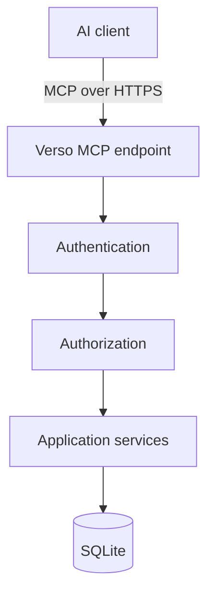
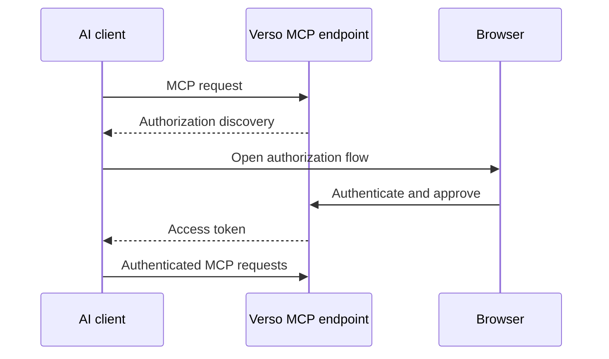

# Verso — Identity and MCP

## Scope

This document defines the unified user identity, capability authorization, and remote MCP boundary. It owns OAuth-compatible MCP access, semantic tool design, AI edit granularity, and optimistic concurrency; it does not define document structure or rendering.

Related: [system architecture](system.md), [content model](content.md), [web editor and preview](editor.md), and [operations and boundaries](operations.md).

## 1. Authentication

Verso has one unified user identity model.

The same identity system is used for:

* web editing;
* MCP;
* future APIs.

Possible roles include:

```text
owner
editor
author
contributor
```

Roles are convenience groupings around permissions.

---

## 2. Authorization

The actual authorization model should be capability-oriented.

Possible permissions include:

```text
document:create

document:read:self
document:read:any

document:update:self
document:update:any

document:review
document:publish
document:archive:manage

asset:read
asset:upload

interactive:create
interactive:publish

user:manage
```

Application services perform authorization.

Interfaces do not implement their own independent security logic.

---

## 3. MCP

MCP is a first-class remote interface for AI-assisted editing.

The initial focus is **online MCP access**.

Local stdio-based editing is outside the initial scope.

Architecture:



MCP must never bypass the application service layer.

---

## 4. MCP Authentication

Remote MCP access should use OAuth-compatible authorization.

Typical flow:



The resulting identity maps to an ordinary Verso user.

An AI acts with the authority granted to that user and token.

---

## 5. MCP Scopes

OAuth scopes provide another authorization boundary.

Initial scopes may include:

```text
content:read
content:write
content:review
content:publish

assets:read
assets:write
```

A recommended AI grant may include:

```text
content:read
content:write
```

without:

```text
content:publish
```

This allows AI-assisted drafting without allowing unattended publication.

---

## 6. MCP Tool Design

MCP should expose semantic editorial operations rather than raw database access.

Potential tools include:

```text
list_documents
search_documents
get_document

create_document
update_document_metadata
create_next_version
export_document
import_document_archive

list_sections
get_section
insert_section
update_section
move_section
delete_section

create_revision
list_revisions
restore_revision

preview_document
preview_section

submit_for_review
publish_document
set_archive_visibility
unpublish_document

list_assets
get_asset
upload_asset
```

The tool set should remain small, composable, and domain-oriented.

Document and section update tools operate on a draft version identified by its
version identity. `create_next_version` accepts only the current published
version as its source; attempting to use an unpublished draft or other
unpublished version as the parent fails. `set_archive_visibility` changes only
the read-only archive's accessibility and requires the archive-management
capability.

`export_document` produces the portable document exchange archive described in
the [content model](content.md#9-document-exchange-archives), from the current
published version or an explicitly selected persisted draft. It includes the
complete section tree and required assets. An authorized administrator or
manager may request the optional presentation bundle for matching local
previews. `import_document_archive` validates the archive and either creates a
new local document draft or updates an explicitly selected existing draft. It
must not publish content, reuse source host identities as authoritative local
IDs, create a new draft from an unpublished source draft, or silently
overwrite a concurrent draft update.

Draft snapshotting, archiving an abandoned draft to preserve it before
starting another draft from the same published parent, and rebasing onto a
newer published version are possible future extensions, not current MCP
operations.

---

## 7. AI Editing Granularity

AI editing should normally target individual sections.

For example:

```text
update_section(
    document_id,
    version_id,
    section_id,
    expected_version,
    expected_revision,
    data
)
```

This is preferable to replacing an entire article when only one section is being edited.

Benefits include:

* fewer accidental modifications;
* lower token usage;
* clearer revision history;
* easier concurrency control;
* better conflict handling.

---

## 8. Optimistic Concurrency

Verso should use optimistic concurrency for editorial mutations. The expected
version and working-revision identity must be checked when saving or publishing
a draft. Publishing must also verify atomically that the draft's
`based_on_version_id` is still the logical document's current published
version. A mutation against a published or archived version fails with an
immutable-version error; the caller must create or select the appropriate
draft next version first.

Example:

```text
current revision = 42

AI submits:
expected_revision = 42
```

If the document has become revision 43 in the meantime, the mutation fails
rather than overwriting newer work. Restoring a working revision or historical
publication version creates or updates a draft; it never edits the historical
source. Publishing a next version atomically archives the old published
version and promotes the draft.

The same mechanism applies to human editors.

If `unpublish_document` is supported, it is a publication-resolution command:
it may remove a version from ordinary public resolution but must not modify the
version's content, turn it back into an editable draft, or rewrite its history.

---
