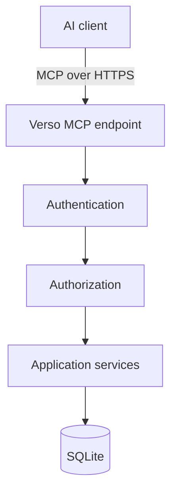
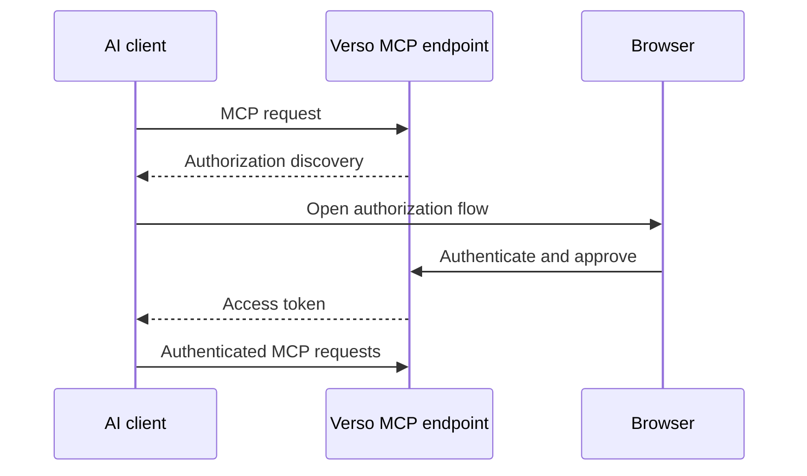

# Verso — Identity and MCP

## Scope

This document defines the unified user identity, capability authorization, and remote MCP boundary. It owns OAuth-compatible MCP access, semantic tool design, AI edit granularity, and optimistic concurrency; it does not define document structure or rendering.

Related: [system architecture](system.md), [content model](content.md), [web editor and preview](editor.md), and [operations and boundaries](operations.md).

## 1. Authentication

Verso has one unified user identity model.

The same identity system is used for:

* web editing;
* MCP;
* future APIs.

Possible roles include:

```text
owner
editor
author
contributor
```

Roles are convenience groupings around permissions.

---

## 2. Authorization

The actual authorization model should be capability-oriented.

Possible permissions include:

```text
document:create

document:read:self
document:read:any

document:update:self
document:update:any

document:review
document:publish

asset:read
asset:upload

interactive:create
interactive:publish

user:manage
```

Application services perform authorization.

Interfaces do not implement their own independent security logic.

---

## 3. MCP

MCP is a first-class remote interface for AI-assisted editing.

The initial focus is **online MCP access**.

Local stdio-based editing is outside the initial scope.

Architecture:



MCP must never bypass the application service layer.

---

## 4. MCP Authentication

Remote MCP access should use OAuth-compatible authorization.

Typical flow:



The resulting identity maps to an ordinary Verso user.

An AI acts with the authority granted to that user and token.

---

## 5. MCP Scopes

OAuth scopes provide another authorization boundary.

Initial scopes may include:

```text
content:read
content:write
content:review
content:publish

assets:read
assets:write
```

A recommended AI grant may include:

```text
content:read
content:write
```

without:

```text
content:publish
```

This allows AI-assisted drafting without allowing unattended publication.

---

## 6. MCP Tool Design

MCP should expose semantic editorial operations rather than raw database access.

Potential tools include:

```text
list_documents
search_documents
get_document

create_document
update_document_metadata

list_sections
get_section
insert_section
update_section
move_section
delete_section

create_revision
list_revisions
restore_revision

preview_document
preview_section

submit_for_review
publish_document
unpublish_document

list_assets
get_asset
upload_asset
```

The tool set should remain small, composable, and domain-oriented.

---

## 7. AI Editing Granularity

AI editing should normally target individual sections.

For example:

```text
update_section(
    document_id,
    section_id,
    expected_revision,
    data
)
```

This is preferable to replacing an entire article when only one section is being edited.

Benefits include:

* fewer accidental modifications;
* lower token usage;
* clearer revision history;
* easier concurrency control;
* better conflict handling.

---

## 8. Optimistic Concurrency

Verso should use optimistic concurrency for editorial mutations.

Example:

```text
current revision = 42

AI submits:
expected_revision = 42
```

If the document has become revision 43 in the meantime, the mutation fails rather than overwriting newer work.

The same mechanism applies to human editors.

---
