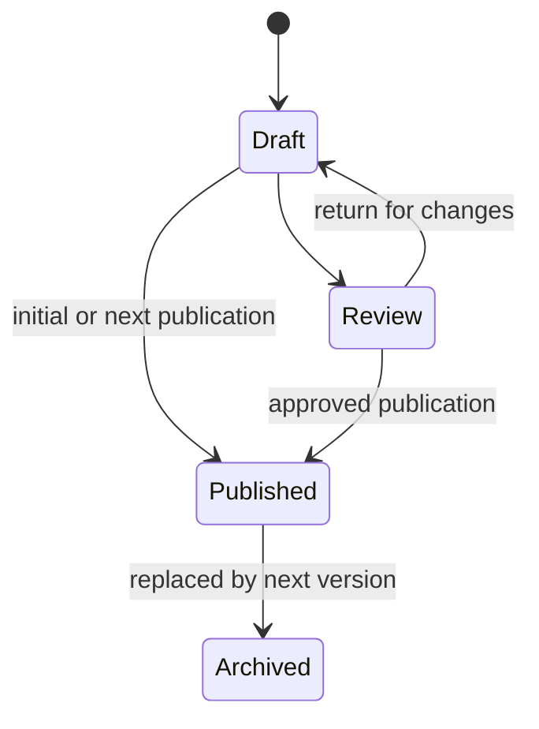
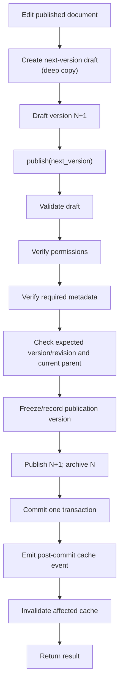
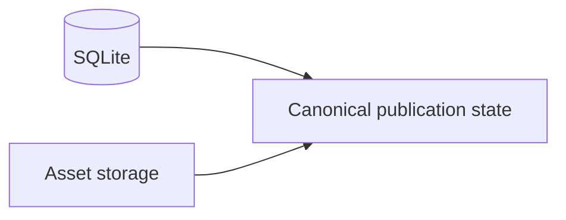
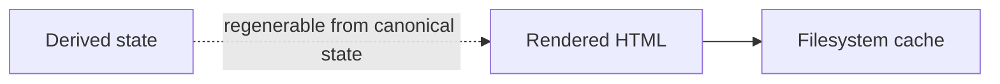
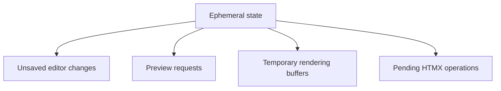
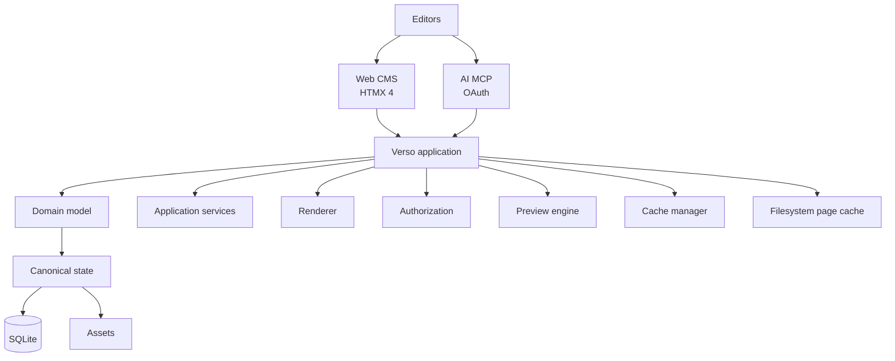

# Verso — Operations and Boundaries

## Scope

This document defines cross-cutting operational policy: publication commands, public/private route boundaries, deployment configuration, UI customization, failure behavior, initial non-goals, and the canonical/derived/recoverable-local/ephemeral state boundary. It does not define the detailed content schema, renderer internals, or MCP tool catalog.

Related: [system architecture](system.md), [routing and static delivery](routing.md),
[content model](content.md), [rendering and cache](rendering.md), [web editor
and preview](editor.md), and [identity and MCP](identity-and-mcp.md).

The configured filesystem asset store is canonical application state and is
never a public static root. A future public-static directory, if needed, must
be a separate explicit deployment setting and must not be inferred from
`storage.filesystem.path`.

## 1. Publication Workflow

A basic workflow is:



Creating a next-version draft does not transition the current published
version; it creates a separate draft version alongside it. The published
version transitions to `archived` only when that next version is published.
Each logical document has at most one mutable unpublished version, in either
`draft` or `review`. An initial document publishes its version 1 draft, whose
`based_on_version_id` is null. A next-version draft may be created only when no
mutable version already exists.

Scheduling and unpublishing are deliberately outside the initial workflow.
`scheduled` is reserved as a future state; no initial operation may create it.
There is no `unpublish` command or state transition. These constraints must not
be bypassed by directly changing a stored version state.

Finalization is an irreversible publication command. A manager may finalize a
published document only when it has no mutable draft or review version. The
command records the finalization, closes every later document-lineage mutation,
and emits invalidation for any previously validated document pages and assets.
After the transaction commits, the final document's fixed public routes and
version-scoped assets may use immutable client-side cache headers. Series,
subject, author, feed, sitemap, and other derived indexes remain revalidated.

The create-next-version operation accepts only the current published version
as its source. It must reject drafts and all other unpublished versions as
parents. A draft's working revisions and unsaved browser form state do not
change this rule.

The state belongs to a numbered document version. Published and archived
versions are immutable, except for the deliberately mutable
`archive_accessible` access-control field. A published document is never edited
in place.
Publication is an application command, not merely changing a status field:

```text
set version.state = "published"
```

Conceptually:



Creating the next version and publishing it are separate operations. The copy
must duplicate all sections and nested objects logically; a physical
copy-on-write representation is allowed only if it preserves independent
version isolation. The publication transaction must fail on stale state and
must leave the previous publication in place if validation, authorization,
concurrency checks, or persistence fails.

The database publication swap is atomic: the new version is published and the
old version is archived together, or neither change is committed. The same
transaction records a pending, idempotent cache-invalidation event. A
post-commit worker processes and retries the event for the filesystem cache
after failure or restart; a cache failure must not roll back the canonical
publication swap.

The archive operation retains the replaced version as a read-only historical
record. Its `archive_accessible` field defaults to true and may be changed by
an actor with the `document:archive:manage` capability. Changing archive
visibility must not modify the version's content. Ordinary public routes
resolve only the current published version; a historical route may resolve an
archived version only when it is accessible. Editorial management may inspect
inaccessible archives read-only.

The same publishing service is called from:

* the web editor;
* MCP;
* future APIs.

The service is also responsible for rejecting writes against published or
archived versions. A request to edit one must first use the create-next-version
operation.

### 1.1 Document exchange

The document exchange archive defined in the [content model](content.md#9-document-exchange-archives)
is handled by application services. Export accepts the current published
version or an explicitly selected persisted draft and produces a self-contained
ZIP archive containing the version snapshot, Markdown sections with YAML front
matter, and all required document asset bytes. An authorized administrator or
manager may explicitly include the optional presentation bundle—theme,
templates, styles, layouts, and presentation assets—for local previews that
match the final design. Export does not include unsaved browser state or
working-revision history.

Import always produces editable draft state. It may create a new logical
document with a new local numerical document ID, or replace the content of an
explicitly selected existing draft. If the target logical document has no
draft, the service may create its next-version draft only from the target's
current published version; the archive's source version is provenance, never
the local parent. Importing into an existing draft updates that draft and does
not fork an unpublished version. A new document starts with a local draft
version 1 and no `based_on_version_id`; an existing draft retains its local
version identity, number, and publication parent.

Import must validate the complete archive before committing canonical changes.
Asset bytes should be staged in an isolated area, verified by their manifest
SHA-256 checksums, and promoted under idempotent content-addressed names with
references remapped to local identities. Invalid archives, unsupported
content, checksum failures, or storage errors must leave the target draft
unchanged and must not create canonical references to unavailable assets.
Unreferenced staged blobs must be cleaned up immediately when possible and by
startup or maintenance reconciliation after a crash. Imported content remains
a draft until the normal publication service validates and publishes it.

---

## 2. Public and Editorial Route Separation

Public and private functionality should remain logically distinct.

Public document URLs use the document's stable numerical ID and the current
version's canonical slug. The collection is derived from the logical document
type, not chosen independently by an editor:

```text
/<collection>/<document-id>/<current-slug>
```

The document ID is authoritative for lookup. The collection is stable because
the document type is stable, while the slug is a routing and presentation
field; the slug is not part of document identity and may change when a later
version becomes current. If a request supplies a slug that differs from the
current canonical slug, Verso redirects to the canonical ID-and-slug URL. An
ID-only request (for example,
`/<collection>/<document-id>`) may likewise redirect to that canonical URL.

Example:

```text
/                         public homepage
/articles/:document-id/:current-slug
                          public current article
/articles/:document-id/versions/:version
                          public read-only historical version, when accessible
/articles/:document-id/versions/:version/assets/:sha256.:extension
                          version-scoped public asset, when its version is visible
/series/:slug             public series
                          ordered current articles; not a document URL prefix
/subjects/:slug           public subject

/admin/...                 editorial application

/mcp                       MCP endpoint

/auth/...                  authentication/authorization
```

Draft content must never be exposed by ordinary public routes.

The route pattern grammar, matching precedence, routing-layer composition, and
static response handlers are specified in [routing and static delivery](routing.md).

---

## 3. Configuration

Verso may use a deployment configuration file such as:

```text
verso.toml
```

Example:

```toml
[runtime]
environment = "production"

[logging]
format = "auto"

[site]
name = "Example Publication"
base_url = "https://example.org"

[server]
host = "127.0.0.1"
port = 8080

[security]
# Comma-separated peer addresses allowed to supply forwarded headers.
trusted_proxy_addresses = ""

[database]
url = "./data/verso.db"

[migrations]
path = "migrations"
run_on_startup = true

[storage.filesystem]
path = "./data/assets"

[cache]
path = "./data/cache"

[ui]
language = "en"
theme = "default"
logo = "/assets/logo.svg"
# icon and logo_wordmark are reserved until their renderers are implemented.

[features]
math = true
interactive_sections = false # enabled only after its security design is specified

[mcp]
enabled = true
allow_publish = false
```

`runtime.environment` is `development` by default. In development, an omitted
`site.base_url` is derived from the configured loopback server address. A
production configuration must provide an explicit non-loopback `base_url`, so
a missing value cannot silently leave the deployment pointing at a local
address.

`migrations.path` identifies the directory containing runtime migration files.
Relative paths are resolved from the process working directory. The default
`migrations` path also falls back to the installed executable's runtime
directory, allowing an installed binary to find its packaged migrations. The
`migrate up` command always uses this path. `migrations.run_on_startup` defaults
to `true`; when enabled, `serve` applies pending migrations before it binds the
HTTP listener. Environment overrides are applied before validation, followed by
command-line overrides.

The focused `migrate up` command surface accepts the global `--config`
selector, database URL, migration path, and logging overrides. The temporary
document bootstrap commands retain their broader configuration options until
their DOC-001/DOC-002 surfaces are replaced.

This startup default is appropriate for the initial SQLite, single-service
deployment. If Verso later targets a shared database or supports multiple
service replicas, deployments should set `migrations.run_on_startup = false`
and run `verso migrate up` as a separate, serialized deployment-pipeline step
before rolling out the service. Only one migration runner should operate on a
target database at a time; application replicas should start after that step
has completed successfully.

`logging.format` accepts `auto`, `json`, `text`, or `pretty`. The default
`auto` format uses JSON in production, pretty output when development stderr
is a TTY, and plain text when development stderr is redirected to a file or
another non-TTY destination. An explicit format applies in every environment.
`logging.omit_null_fields` defaults to `true` and removes optional fields whose
value is null from all log formats; set it to `false` when explicit nulls are
needed. Log records conventionally use `event` for a stable machine-readable
identifier and `message` for a human-readable description. Pretty output uses
`message` as its headline when present and falls back to `event`; JSON and text
output retain both fields.

### Record message templates

In addition to `timestamp` and `timestamp_ms`, `format` is a reserved log
record field. It is a `[]const u8` message-template control field, not ordinary
record data. A non-empty `format` replaces the normal message headline in
pretty output and the normal message value in text output. The logger renders
the template before emitting remaining `key=value` fields. An empty `format`
uses the ordinary `message`/`event` behavior.

Templates use named placeholders: `{field}` inserts the record field named
`field`; `{{` and `}}` insert literal braces. A placeholder may name any
non-reserved field in the record, and its value uses the same human-readable
rendering as a pretty headline. Referencing a missing field, a reserved field,
or malformed template syntax is a compile error; it must not silently produce
an ambiguous message. A field mentioned one or more times by a placeholder is
considered consumed and is omitted from the trailing `key=value` fields. Other
non-null fields retain their declaration order. `format` itself is never
emitted as a trailing field in text or pretty output.

Record writers use a comptime field when a template is intrinsic to the record
type and never needs a per-record override:

```zig
comptime format: []const u8 = "request {method} completed with {status}",
```

A non-empty comptime template is parsed, checked against the record shape, and
compiled into the record type's formatting path. The logger selects that path
unconditionally: it neither reads a runtime `format` value nor checks for a
dynamic override. This is the normal, inexpensive form for application-owned
record types.

The initial implementation accepts only a comptime `format` field. A
non-comptime `format` field is a compile error, even when it has a default:
runtime template overrides and their parser are deliberately deferred until a
concrete need justifies them.

JSON remains a complete structured representation: it includes the record's
ordinary fields, including those consumed by a template. Its comptime `format`
control field is always omitted. The logger-owned timestamp remains present in
every format.

HTTP request records use one `duration_ms` field, measured with the monotonic
clock and serialized as a fractional `f32` number of milliseconds.
Human-readable request lines display milliseconds below one second and seconds
at or above one second; machine-readable records retain the stable millisecond
unit. Request targets retain the path and query keys while redacting query
values, omitting absolute-form authorities, and bounding the logged length.
The same field is used for completed requests and downstream failures;
connection failures use a focused record with the duration and error name only.

The configuration file is optional. When the default `verso.toml` is absent,
Verso starts from built-in defaults and continues through the normal override
and validation process. An explicitly selected path is required to exist; a
missing selected file is an error. The file remains useful for persistent
deployment settings, but it is not a startup prerequisite.

`database.url` accepts a bare path as a SQLite shorthand, such as
`./data/verso.db`, or a database URL. Only the `sqlite` scheme is implemented
initially; other schemes are rejected until their adapters exist. Storage is a
tagged configuration: `[storage.filesystem]` is the only supported variant for
now.

The UI language is an allowlisted deployment setting. Only `en` is supported
initially and is used for UI pages' HTML `lang` attribute. Document pages use
their version-owned language; new documents default that language from the UI
setting when created. Site identity and UI presentation remain separate:
`site.name` identifies the publication, while `ui.logo` controls presentation.
A lone `ui.logo` is used in every logo context;
`ui.icon` and `ui.logo_wordmark` are accepted as reserved configuration fields
but currently fail validation because their renderers are not implemented.

Secrets should not normally be stored directly inside publicly tracked
configuration files.

### Initial user provisioning

The first-user configuration is an explicit bootstrap surface rather than a
general user-management configuration. Its local-password shape is:

```toml
[auth.bootstrap]
display_name = "Site Owner"
email = "owner@example.org"
# subject = "local-owner"       # local/provider subject when known
# login = "owner@example.org"   # required for local password login
# password_hash = "$argon2id$v=19$..."  # required for local password login
```

The record may be provided by `verso.toml` or by corresponding `VERSO_AUTH_BOOTSTRAP_*`
environment variables, but not by ordinary `serve` CLI overrides. A complete
local record is applied during startup only when the database has no user row.
A partial record always fails validation; after a user exists, a complete record is an idempotent no-op and
cannot mutate identity state. Secrets should use environment or an equivalent
secret-injection mechanism rather than a tracked TOML file, and password
hashes must be redacted from config dumps, diagnostics, and logs.

When a configured OIDC provider is available, the script and configuration
paths may omit `subject`, `login`, and `password_hash` and provide an OIDC
email target instead. This creates a pending, non-authenticating owner claim
that is completed only by a verified callback from that exact issuer whose
normalized email exactly matches the configured target; the email value alone
is never proof of identity. The pending-claim design is reserved for the OIDC
follow-up; it will lock initialization so another web, script, or configuration
bootstrap cannot race or replace it.

Environment overrides are optional. Configuration precedence, from lowest to
highest, is built-in defaults, the optional `verso.toml`, environment variables,
then command-line arguments. The command-line interface uses an explicit
exposure allowlist of configuration options, and its values win over all other
sources.

### Configuration source of truth

`config.Config` is the canonical semantic configuration schema. It owns the
configuration field names and nesting, Zig types, built-in defaults, TOML
shape, and validation rules. CLI and environment support must derive from this
type rather than define a second set of configuration fields or types.

The initial `serve` CLI surface should be generated at comptime from
`config.Config`. A separate sparse metadata object supplies only CLI
presentation and exposure metadata for existing configuration fields:

```zig
const serve_cli_metadata = .{
    .{
        .config_field = "server.port",
        .cli_enabled = true,
        .description = "HTTP bind port.",
    },
};
```

Metadata entries may be omitted. An omitted entry means that the corresponding
configuration field has no `serve` CLI override or extra help description.
Metadata may mark an existing field as enabled or disabled and may provide an
optional short description, but it must not define configuration values,
types, defaults, or alternate configuration fields. A comptime validation step
must reject any `config_field` path that does not resolve to a field in
`config.Config`. The metadata object is therefore a list of metadata records,
not a second configuration schema; its own fields are metadata-only and its
paths may identify only existing `Config` fields.

This choice can be revisited if the metadata grows beyond CLI exposure and
presentation. If it eventually contains the complete field types, defaults,
TOML shape, validation rules, environment behavior, and custom mappings, it
may be promoted into a full `ConfigSchema` and used to generate `Config` and
all derived interfaces. That is a possible future architecture, not a reason
for the current sparse CLI metadata to duplicate configuration semantics.

The generated `serve --help` text will be the parser contract. Its option names,
value parser types, CLI override transport, and application paths come from
`Config`; metadata controls only whether an existing field is exposed and how
it is described. The global `--config` selector is an explicit CLI control and
is not a `Config` field. Tagged unions such as filesystem storage may retain
small explicit custom mappings where a flat option name is required.

Environment names and parsers use the same `Config` reflection. There is no
separately maintained environment-variable allowlist. Ordinary scalar fields
use the uppercase nested field-path convention: for example,
`server.port` becomes `VERSO_SERVER_PORT`, and `ui.logo` becomes
`VERSO_UI_LOGO`. Tagged unions and other exceptional mappings are explicit
custom cases; the initial storage mapping is `VERSO_STORAGE_FS_PATH` for
`storage.filesystem.path`. Unknown variables, including unknown `VERSO_*`
variables, are ignored.

Boolean overrides must be exactly `true` or `false`; enum and integer values
use the same lowercase names and decimal representation as the configuration
file. Operator-facing environment-variable reference tables may be generated
from this reflection, but such tables are documentation output and never a
second source of truth.
All overrides are applied before the normal validation pass, so a production
deployment still requires a public non-loopback base URL even when that value
is supplied through the environment. Environment-provided database URLs are
never included in configuration errors or startup diagnostics and are the
preferred place for deployment-specific credentials once non-SQLite adapters
exist.

For now, this generated source-of-truth contract applies primarily to
`verso serve`. The document bootstrap commands belong to DOC-001 and DOC-002;
they are temporary local verification interfaces and are not part of this
configuration-schema design. The migration command may consume the same
generated configuration metadata later, but its command-specific surface is
not required to define the initial `serve` contract.

Boolean values must be exactly `true` or `false`; enum and integer values use
the same lowercase names and decimal representation as the configuration
file. Commands emit a `configuration.loaded` diagnostic with the selected
file without logging effective database URLs or other secret values.

---

## 4. Backup and Restore

A canonical backup contains a consistent SQLite snapshot and every asset
referenced by that snapshot. The implementation must coordinate this with a
maintenance write barrier or a storage snapshot; copying a live database file
alone, or copying an uncoordinated data directory, is not a valid backup
procedure. In particular, a backup must account for SQLite WAL state.

Filesystem page caches are not part of a canonical backup. Asset checksums,
database schema compatibility, and
asset-reference integrity must be verified in an isolated restore location
before a restored deployment is made live. Operators should test restoration
periodically rather than relying on backup creation alone.

The database, asset store, staging area, backups, and secrets must be writable
only by the service account and must not be web-served. The cache directory is
also outside the public static root; Verso serves cache entries only after its
route and visibility checks.

---

## 5. UI Customization

Verso should separate publication data from presentation.

Customization may include:

```text
theme
templates
CSS
CSS variables
logo
typography
navigation behavior
homepage structure
document layouts
```

The first implementation should define a small, coherent theme contract rather than a completely generic theme engine.

---

## 6. Failure Principles

Verso should prefer failure modes that preserve canonical content.

Examples:

### Cache failure

If cache writing fails:

```text
canonical publication remains valid
```

The page can be rendered again.

### Preview failure

If preview rendering fails:

```text
draft remains untouched
```

### Publishing failure

If validation fails:

```text
the new version remains unpublished and the current published version remains
current
```

If archiving or publication persistence fails, the transaction rolls back and
the current publication remains unchanged. If cache invalidation fails after a
successful commit, canonical content remains valid and the affected public and
historical pages can be regenerated or invalidated by retry.

### MCP conflict

If another editor modified a document:

```text
operation returns conflict
```

rather than overwriting the newer version.

---

## 7. Non-Goals for Initial Versions

The first versions do not need to provide:

* PostgreSQL;
* MySQL;
* multiple database engines;
* distributed Verso server clusters;
* real-time character-by-character collaborative editing;
* CRDTs;
* arbitrary script execution in the main page;
* enabling interactive module execution before its dedicated security design;
* visual no-code page building;
* generic relational-data construction;
* third-party plugin marketplaces;
* dozens of publishing workflow states;
* complex workflow engines;
* local MCP editing;
* Git-based storage;
* Git-based publishing;
* mandatory client-side SPA frameworks;
* automatic cache eviction based on inactivity.

These may be evaluated if actual requirements appear.

---

## 8. Design Philosophy

Verso should distinguish clearly between four categories of state.

### Canonical state



This represents the publication.

---

### Derived state



This can always be regenerated.

---

### Ephemeral state



This should not become canonical accidentally.

The architecture should preserve these boundaries consistently.

---

## 9. Summary

Verso is a self-hosted publishing server built around:



The central architectural decisions are:

* **Zig** for the server implementation;
* **SQLite-only** initially;
* **structured documents composed of sections**;
* **Markdown inside text sections**;
* **versioned JS/WASM interactive modules**;
* **server-side rendering**;
* **filesystem caching for published pages**;
* **no public caching of mutable drafts**;
* **HTMX 4 for server-transactional section editing**;
* **server-rendered, production-equivalent previews of persisted drafts**;
* **preview, save, and publish as distinct operations**;
* **remote MCP as a first-class AI editing interface**;
* **OAuth and permission-scoped MCP access**;
* **optimistic concurrency for human and AI edits**;
* **one shared application/domain layer for web, MCP, rendering, and publication**.

Verso should remain small enough to self-host easily while providing enough structure to support sophisticated technical and interactive publications.
