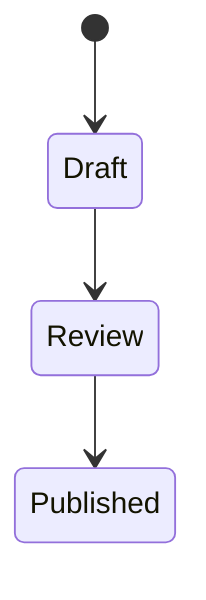
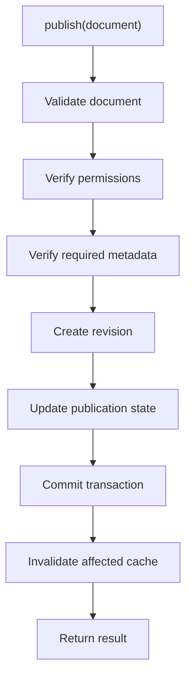
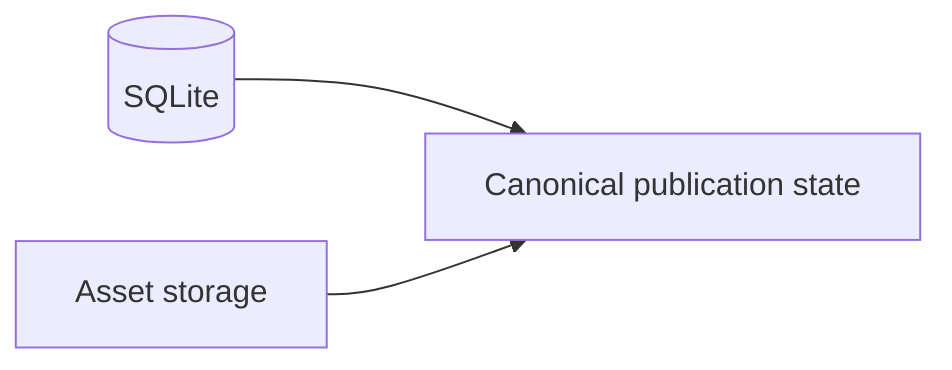
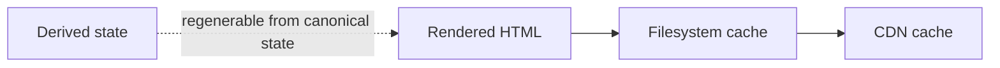
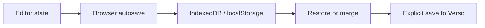
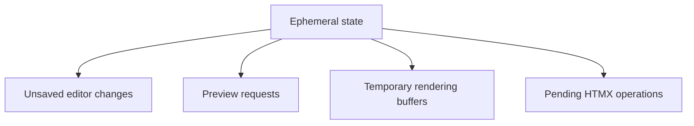
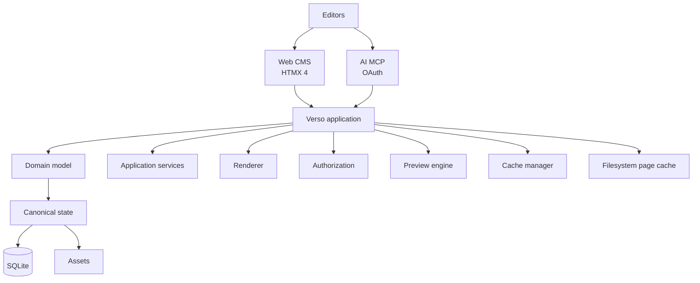

# Verso — Operations and Boundaries

## Scope

This document defines cross-cutting operational policy: publication commands, public/private route boundaries, deployment configuration, UI customization, failure behavior, initial non-goals, and the canonical/derived/recoverable-local/ephemeral state boundary. It does not define the detailed content schema, renderer internals, or MCP tool catalog.

Related: [system architecture](system.md), [content model](content.md), [rendering and cache](rendering.md), [web editor and preview](editor.md), and [identity and MCP](identity-and-mcp.md).

## 1. Publication Workflow

A basic workflow is:



Publication is an application command, not merely:

```sql
UPDATE documents SET status = 'published'
```

Conceptually:



The same publishing service is called from:

* the web editor;
* MCP;
* future APIs.

---

## 2. Public and Editorial Route Separation

Public and private functionality should remain logically distinct.

Example:

```text
/                         public homepage
/articles/:slug           public article
/series/:slug             public series
/subjects/:slug           public subject

/admin/...                 editorial application

/mcp                       MCP endpoint

/auth/...                  authentication/authorization
```

Draft content must never be exposed by ordinary public routes.

---

## 3. Configuration

Verso should use a deployment configuration file such as:

```text
verso.toml
```

Example:

```toml
[site]
name = "Example Publication"
base_url = "https://example.org"
language = "en"

[server]
host = "127.0.0.1"
port = 8080

[database]
path = "./data/verso.db"

[storage]
type = "filesystem"
path = "./data/assets"

[cache]
path = "./data/cache"

[ui]
theme = "default"
logo = "/assets/logo.svg"

[features]
math = true
interactive_sections = true

[editor]
preview_debounce_ms = 250

[mcp]
enabled = true
allow_publish = false
```

Secrets should not normally be stored directly inside publicly tracked configuration files.

Environment variables or dedicated secret mechanisms may override sensitive configuration.

---

## 4. UI Customization

Verso should separate publication data from presentation.

Customization may include:

```text
theme
templates
CSS
CSS variables
logo
typography
navigation behavior
homepage structure
document layouts
```

The first implementation should define a small, coherent theme contract rather than a completely generic theme engine.

---

## 5. Failure Principles

Verso should prefer failure modes that preserve canonical content.

Examples:

### Cache failure

If cache writing fails:

```text
canonical publication remains valid
```

The page can be rendered again.

### Preview failure

If preview rendering fails:

```text
draft remains untouched
```

### Publishing failure

If validation fails:

```text
document remains unpublished
```

### MCP conflict

If another editor modified a document:

```text
operation returns conflict
```

rather than overwriting the newer version.

---

## 6. Non-Goals for Initial Versions

The first versions do not need to provide:

* PostgreSQL;
* MySQL;
* multiple database engines;
* distributed Verso server clusters;
* real-time character-by-character collaborative editing;
* CRDTs;
* arbitrary script execution in the main page;
* visual no-code page building;
* generic relational-data construction;
* third-party plugin marketplaces;
* dozens of publishing workflow states;
* complex workflow engines;
* local MCP editing;
* Git-based storage;
* Git-based publishing;
* mandatory client-side SPA frameworks.

These may be evaluated if actual requirements appear.

---

## 7. Design Philosophy

Verso should distinguish clearly between four categories of state.

### Canonical state



This represents the publication.

---

### Derived state



This can always be regenerated.

---

### Recoverable local draft state

```text
browser autosave
IndexedDB or localStorage
local draft snapshot
```

This state is durable enough to recover interrupted editing, but it is not
canonical and is not guaranteed to exist on another browser or device. It may
be restored, merged, or discarded explicitly by the editor.



---

### Ephemeral state



This should not become canonical accidentally.

The architecture should preserve these boundaries consistently.

---

## 8. Summary

Verso is a self-hosted publishing server built around:



The central architectural decisions are:

* **Zig** for the server implementation;
* **SQLite-only** initially;
* **structured documents composed of sections**;
* **Markdown inside text sections**;
* **versioned JS/WASM interactive modules**;
* **server-side rendering**;
* **filesystem caching for published pages**;
* **no public caching of mutable drafts**;
* **HTMX 4 for the web editor**;
* **server-rendered, production-equivalent side previews**;
* **preview, save, and publish as distinct operations**;
* **remote MCP as a first-class AI editing interface**;
* **OAuth and permission-scoped MCP access**;
* **optimistic concurrency for human and AI edits**;
* **one shared application/domain layer for web, MCP, rendering, and publication**.

Verso should remain small enough to self-host easily while providing enough structure to support sophisticated technical and interactive publications.
