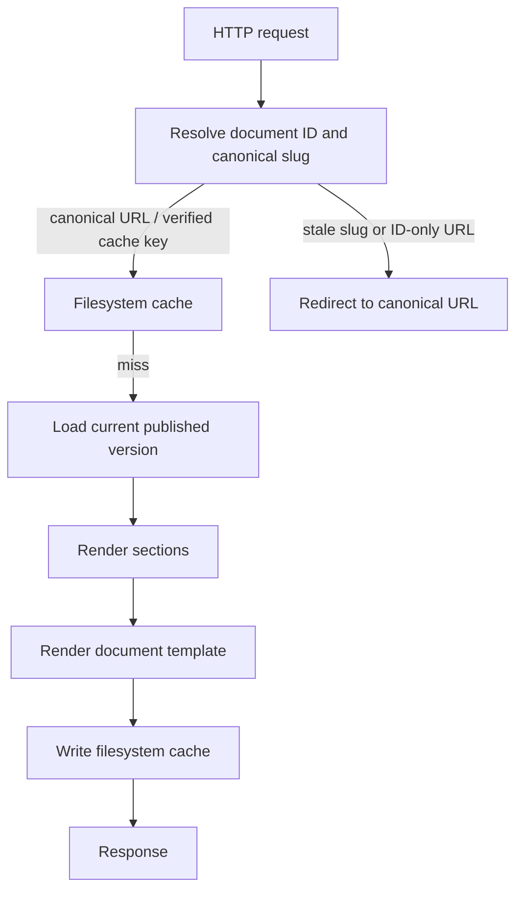
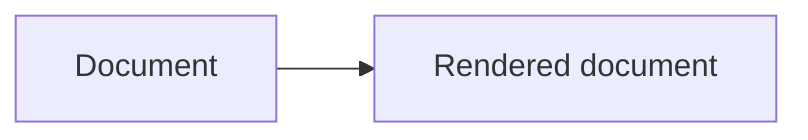
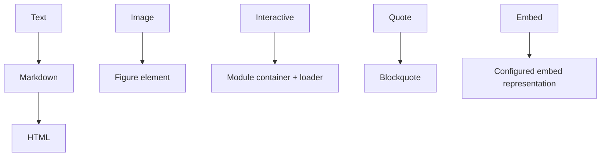
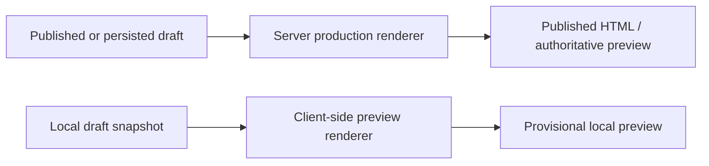
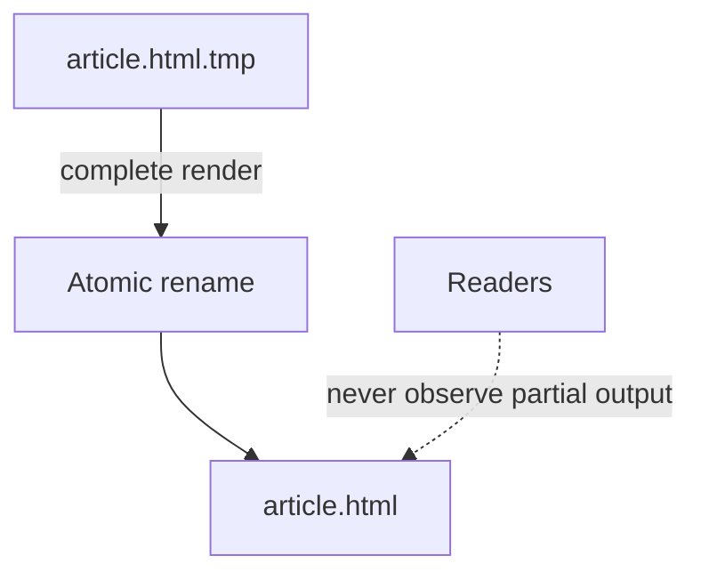
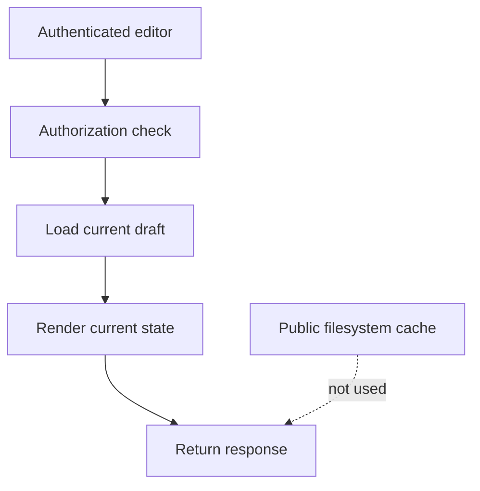

# Verso — Rendering and Cache

## Scope

This document defines the server transformation from canonical content to public HTML and the lifecycle of derived page output. It owns rendering, filesystem caching, invalidation, atomic writes, and draft-cache boundaries; it does not define editorial UX or persistence schemas. Client-side previews are covered in [web editor and preview](editor.md); the server renderer remains their authority.

Related: [content model](content.md), [system architecture](system.md), [web editor and preview](editor.md), and [operations and boundaries](operations.md).

## 1. Public Rendering

Verso renders public pages on the server.

Conceptually:



Server rendering is therefore primarily performed when a page is not already cached.

Every document-related response is validated by Verso before use. The server
first resolves the document and current visibility, then may serve a matching
internal filesystem cache entry. Document pages, historical pages,
document-scoped assets, and document-derived index pages send
`Cache-Control: private, no-cache`, so browsers must revalidate them with
Verso before reuse. This is the initial cache policy, except for the fixed
public routes and assets of a finalized document. There is no public response
cache outside the application.

---

## 2. Rendering Pipeline

Rendering should be conceptually pure:



Each section type has a renderer:



The rendering engine should not care whether the document was requested by:

* a public page;
* the editor preview;
* MCP;
* a future API;
* internal cache regeneration.

The server renderer is authoritative for publication output and for explicit
previews of persisted drafts. The editor uses a compatible client-side renderer
for immediate previews of unsaved local state. Client output is provisional and
may be incomplete for features that require server-side document context.



---

### 2.1 Rendered-content safety

All document data is untrusted rendering input, including content supplied by
an authenticated editor, MCP client, archive import, or a persisted draft.
The initial Markdown profile must disable raw HTML. It may produce only the
documented Markdown elements; unsupported HTML is rendered as text or rejected
on save and import. A later raw-HTML feature would require its own explicit,
sanitized capability model.

Renderers must escape text and attribute values, construct element names and
attributes from fixed server-controlled sets, and validate URLs before placing
them in an `href` or `src` attribute. Document links may use relative URLs,
fragments, and the `https`, `http`, and `mailto` schemes. An authored
`assets://name` reference is resolved only against the loaded version's named
asset collection and replaced with an authorized version-scoped URL before
normal URL validation; it must never be emitted as an HTML URL. Renderers must
reject scriptable or ambiguous schemes such as `javascript:` and `data:`.
Inline event handlers, executable inline scripts, and editor-provided
stylesheets are not part of the initial content profile.

The same safe rendering path applies before output is placed in the published
cache or returned from an explicit server preview. The public and editorial
responses should send a restrictive Content Security Policy appropriate to
their separate interfaces. At minimum, public pages must forbid plugins and
object embedding, disallow inline executable scripts, restrict `base-uri`, and
allow scripts, styles, images, and connections only from explicitly configured
origins. The editorial policy must be at least as restrictive for untrusted
content.

---

## 3. Published Page Cache

Rendered published pages should use filesystem caching.

The filesystem cache is disposable derived state.

Example:

```text
data/cache/
├── index.html
├── articles/
│   └── example.html
├── series/
│   └── number-theory.html
└── subjects/
    └── mathematics.html
```

The entire cache directory should be safely removable:

```bash
rm -rf data/cache/*
```

Verso should regenerate missing entries automatically.

SQLite remains the source of truth.

---

## 3.1. Planned Inactivity Eviction

Automatic eviction of cache entries that have not been used for a configured
period is a planned feature, not part of the initial implementation. The
initial cache may grow until an operator removes entries or the cache storage
is otherwise managed externally.

When implemented, eviction should apply only to disposable rendered output.
It may remove inactive current-publication pages and independently cached
historical pages; the next request must regenerate any removed entry from the
canonical version. It must never delete or mutate document versions, sections,
assets, or other canonical state. Cache eviction should also be safe around
concurrent reads and writes, and should tolerate a race by leaving a valid
regenerable cache miss rather than affecting publication.

The inactivity policy, including how access is tracked and whether it is
configurable, can be decided when cache maintenance is implemented. It should
not be confused with archive visibility: hiding an archived version is an
access-control mutation that requires immediate invalidation, whereas
inactivity eviction is best-effort storage maintenance.

---

## 4. Why the Cache Is Not Stored in SQLite

Rendered HTML should normally not be stored inside the database.

SQLite contains canonical state.

The filesystem contains regenerable output.

This avoids:

* database growth from derived HTML;
* unnecessary SQLite writes;
* coupling cache lifetime to database backups;
* cache regeneration interfering with canonical transactions.

The filesystem also benefits naturally from the operating system's page cache.

---

## 5. Cache Writes

Cache generation should use atomic replacement.

Conceptually:



Readers should never observe partially generated pages.

---

## 6. Cache Invalidation

Cache invalidation should be event-driven.

Publishing a next document version may invalidate:

```text
/<collection>/<document-id>/<current-slug>
old current-slug URL
/<collection>/<document-id> ID-only redirect response
/
series pages
subject pages
author pages
feed
sitemap
related-document indexes
```

Only pages affected by the operation should need invalidation. The ordinary
ID-and-slug route must stop resolving to the archived version and start
resolving to the newly published version after the publication transaction
commits. A request using an outdated slug must redirect to the new canonical
ID-and-slug URL rather than creating a second public identity for the document.
The old-slug page and any ID-only redirect response must therefore be
invalidated in the filesystem cache.

The request path must resolve the document ID and current canonical slug
before serving a URL-keyed page cache entry, unless the cache entry is known to
be keyed by a still-canonical URL. This prevents a stale old-slug page from
bypassing redirect handling. There is no outer cache layer in the initial
design.

Historical pages for accessible archived versions are immutable derived output
and may be retained in Verso's internal filesystem cache only after the
application has checked the archive's current visibility. Unless their logical
document is finalized, historical responses use `Cache-Control: private,
no-cache`: a browser may retain a response but must revalidate it with Verso
before reuse. The filesystem cache directory must not be mounted directly as a
public static directory. If an actor hides an archive, its historical route and
internal cache entry must no longer be publicly served; the request path
enforces that access check before using cached output. This controls future
server responses but cannot retract bytes already saved by a visitor.
Authorized editorial inspection remains private and read-only.

Finalization is the sole immutable-cache exception. Once a manager has
irrevocably finalized a document, each of its accessible document-version
pages, current-document page, and version-scoped document assets sends
`Cache-Control: public, max-age=31536000, immutable` and may be served from
the internal filesystem cache without a canonical-state revalidation. Derived
indexes such as series, author, subject, feeds, and sitemap remain validated:
they can change because of other documents even when one member is final.

Cache invalidation work must be durable. The publication or archive-visibility
transaction creates an idempotent pending invalidation record in SQLite along
with the canonical mutation. A post-commit worker processes that record for
the filesystem cache, records attempts, and keeps retrying after failures or
restart until processing succeeds. Cache cleanup is derived-state work and
cannot roll back the committed canonical mutation.

The first implementation may use straightforward invalidation rather than sophisticated dependency graphs.

---

## 7. Draft Rendering and Caching

Drafts and mutable editorial views should not use the public filesystem page cache.

A draft request follows approximately:



Private preview routes use restrictive caching headers:

```text
Cache-Control: private, no-store
```

The key rule is:

> Mutable editorial state is not cached as public rendered output.

Immutable historical document versions may be retained in the internal
filesystem cache after their current `archive_accessible` check, but are not
cacheable outside Verso in the initial design. Drafts and unsaved previews
remain uncacheable as public output.

---
