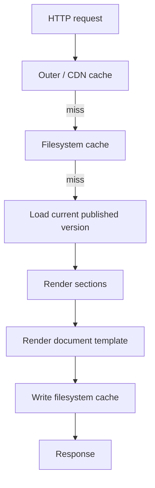
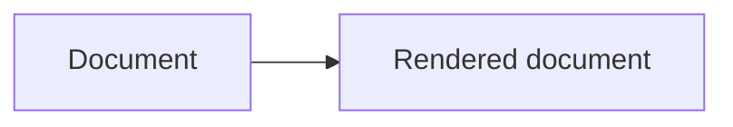
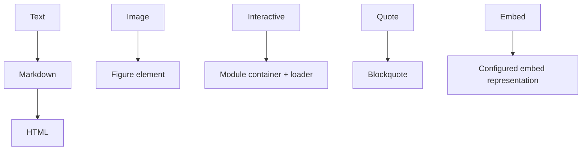
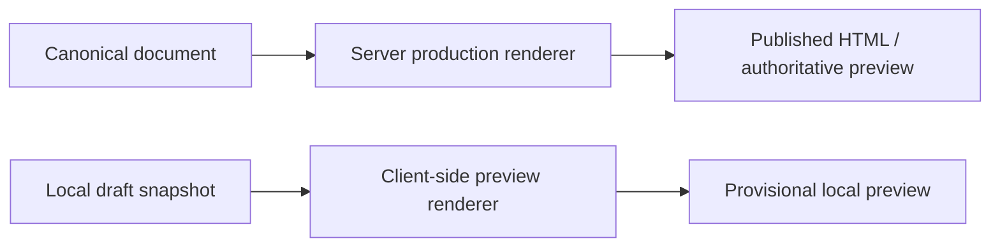
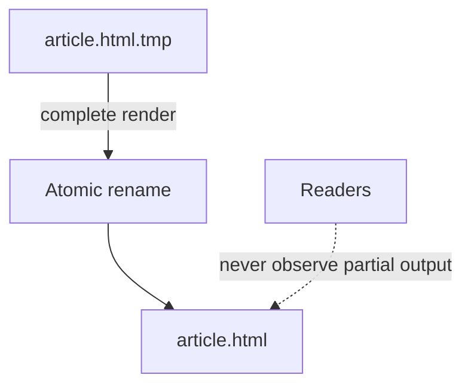
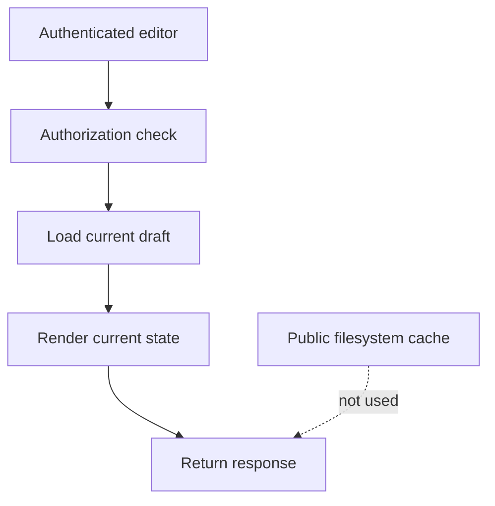

# Verso — Rendering and Cache

## Scope

This document defines the server transformation from canonical content to public HTML and the lifecycle of derived page output. It owns rendering, filesystem caching, invalidation, atomic writes, and draft-cache boundaries; it does not define editorial UX or persistence schemas. Client-side previews are covered in [web editor and preview](editor.md); the server renderer remains their authority.

Related: [content model](content.md), [system architecture](system.md), [web editor and preview](editor.md), and [operations and boundaries](operations.md).

## 1. Public Rendering

Verso renders public pages on the server.

Conceptually:



Server rendering is therefore primarily performed when a page is not already cached.

---

## 2. Rendering Pipeline

Rendering should be conceptually pure:



Each section type has a renderer:



The rendering engine should not care whether the document was requested by:

* a public page;
* the editor preview;
* MCP;
* a future API;
* internal cache regeneration.

The server renderer is authoritative for publication output. The editor may
also use a compatible client-side renderer for immediate previews of local
drafts. Client output is provisional and may be incomplete for features that
require server-side document context.



---

## 3. Published Page Cache

Rendered published pages should use filesystem caching.

The filesystem cache is disposable derived state.

Example:

```text
data/cache/
├── index.html
├── articles/
│   └── example.html
├── series/
│   └── number-theory.html
└── subjects/
    └── mathematics.html
```

The entire cache directory should be safely removable:

```bash
rm -rf data/cache/*
```

Verso should regenerate missing entries automatically.

SQLite remains the source of truth.

---

## 4. Why the Cache Is Not Stored in SQLite

Rendered HTML should normally not be stored inside the database.

SQLite contains canonical state.

The filesystem contains regenerable output.

This avoids:

* database growth from derived HTML;
* unnecessary SQLite writes;
* coupling cache lifetime to database backups;
* cache regeneration interfering with canonical transactions.

The filesystem also benefits naturally from the operating system's page cache.

---

## 5. Cache Writes

Cache generation should use atomic replacement.

Conceptually:



Readers should never observe partially generated pages.

---

## 6. Cache Invalidation

Cache invalidation should be event-driven.

Publishing a next document version may invalidate:

```text
/document/:slug
/
series pages
subject pages
author pages
feed
sitemap
related-document indexes
```

Only pages affected by the operation should need invalidation. The ordinary
slug route must stop resolving to the archived version and start resolving to
the newly published version after the publication transaction commits.

Historical pages for accessible archived versions are immutable derived output
and may be cached independently. If an author hides an archive, its historical
route and any corresponding cache entry must no longer be publicly served. The
visibility mutation must emit an invalidation event, and the request path must
also enforce the access check so a stale cache entry cannot expose the archive.
Authorized editorial inspection remains private and read-only.

The first implementation may use straightforward invalidation rather than sophisticated dependency graphs.

---

## 7. Draft Rendering and Caching

Drafts and mutable editorial views should not use the public filesystem page cache.

A draft request follows approximately:



Private preview routes should normally use restrictive caching headers such as:

```text
Cache-Control: private, no-store
```

The key rule is:

> Mutable editorial state is not cached as public rendered output.

Immutable historical document versions may be cached safely if useful, subject
to their `archive_accessible` setting. Drafts and unsaved previews remain
uncacheable as public output.

---
