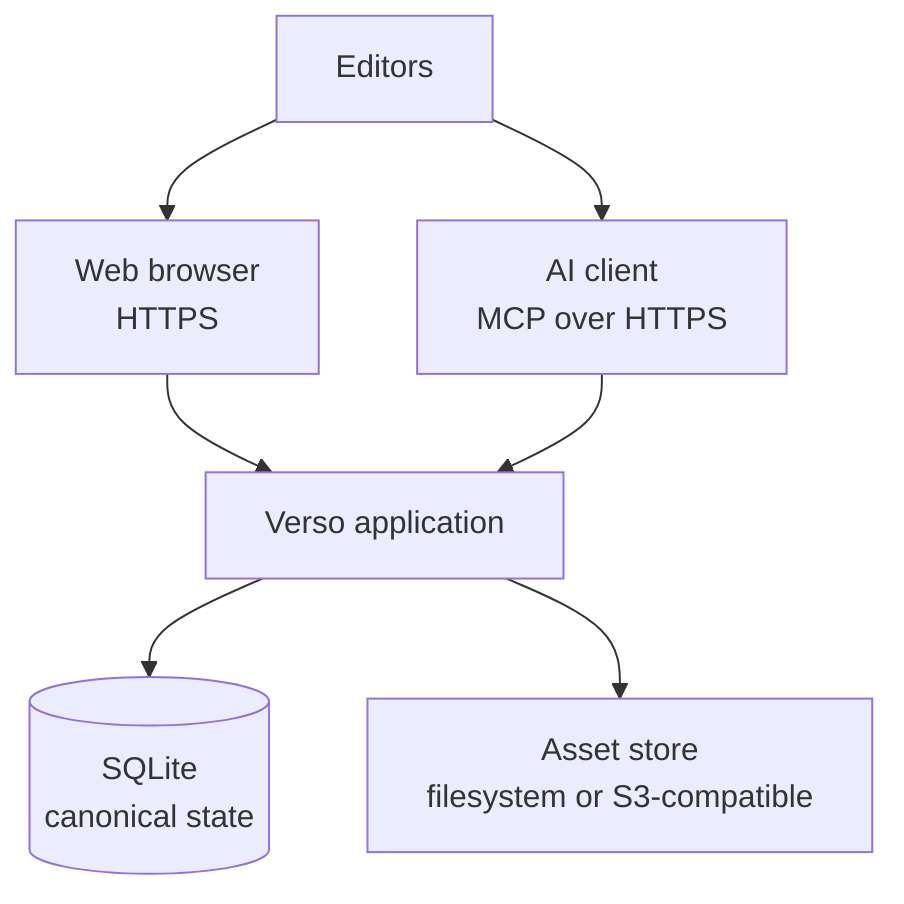
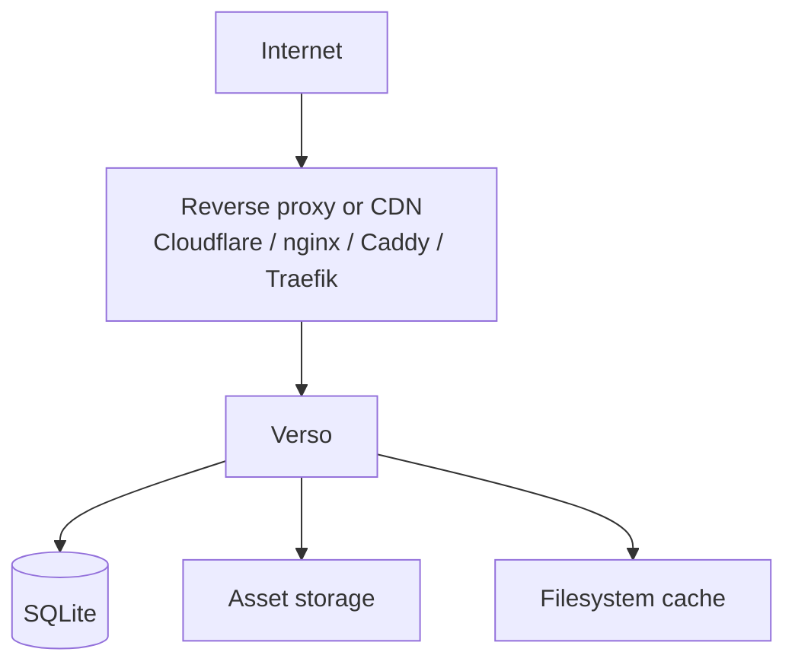
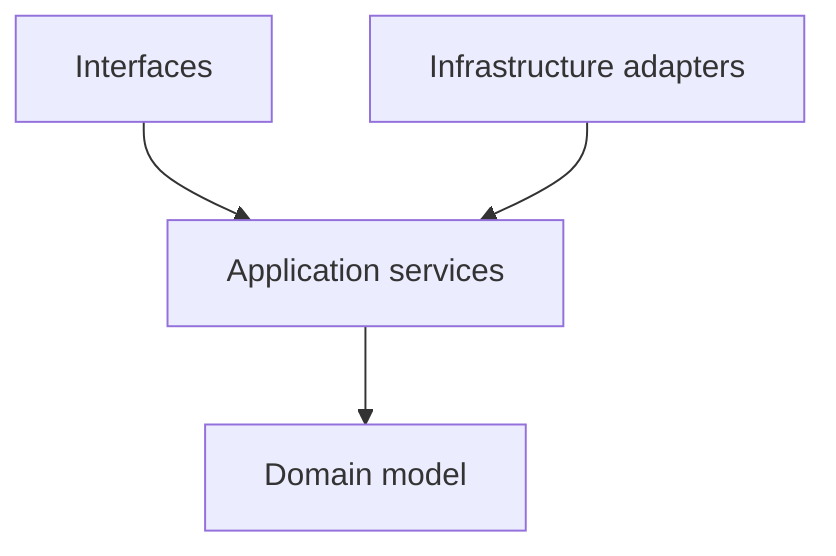
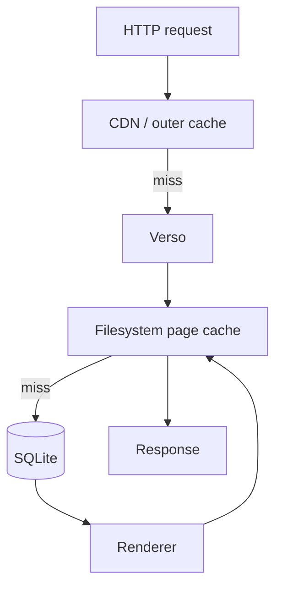
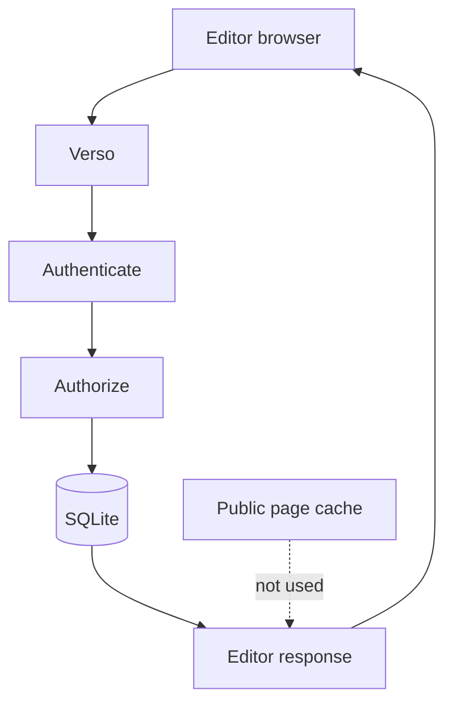
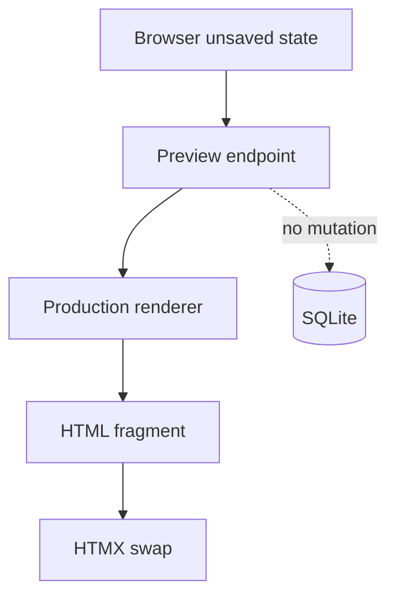
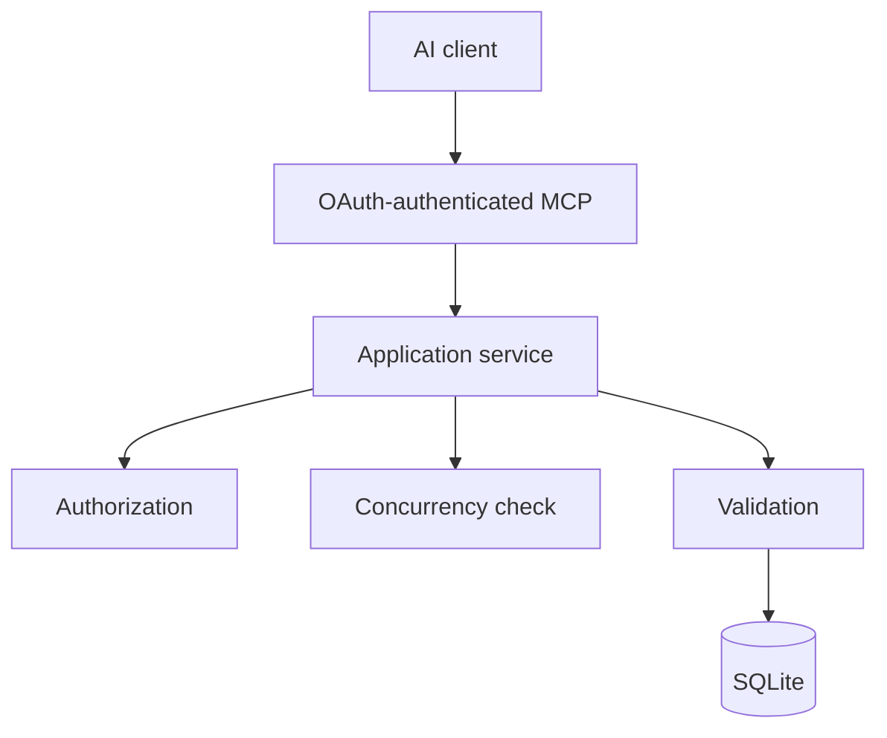

# Verso — System Architecture

## Scope

This document defines Verso's runtime topology: the single application, its deployment shape, technology direction, persistence boundary, internal dependency direction, and representative request paths. It does not define the document schema, rendering rules, editor behavior, or identity policy.

Related: [content model](content.md), [rendering and cache](rendering.md), [web editor and preview](editor.md), and [identity and MCP](identity-and-mcp.md).

## 1. High-Level Architecture

Verso is primarily a single application.



All interfaces operate through the same application/domain layer.

The web interface and MCP interface must never independently manipulate SQLite.

---

## 2. Initial Technology Direction

The implementation is intentionally experimental.

The initial target stack is:

```text
Language:              Zig
Database:              SQLite
Public rendering:      server-side HTML
Editorial frontend:    HTMX 4 + minimal JavaScript
Text content:          Markdown
Asset storage:         filesystem initially
Optional asset store:  S3-compatible storage / RustFS
Interactive content:   JavaScript and/or WASM
Page cache:            filesystem
Outer cache:           CDN / reverse proxy
AI integration:        remote MCP
MCP authentication:    OAuth-compatible authorization
```

SQLite, filesystem caching, and a single-process server are deliberate design choices rather than placeholders for a more complex architecture.

---

## 3. Deployment Model

The default deployment should be approximately:

```text
verso
verso.toml
data/
├── verso.db
├── assets/
└── cache/
```

A basic installation should require little more than:

```bash
verso init
verso serve
```

No separate database server is required.

A production environment may place a reverse proxy or CDN in front of Verso:



Verso itself should not depend on a specific reverse proxy.

---

## 4. SQLite

SQLite is the sole database backend for the initial versions of Verso.

It stores canonical structured application state including:

```text
documents
sections
revisions

users
roles
permissions

authors
subjects
series

asset metadata
interactive module metadata

authentication data
OAuth authorization data
```

Large binaries should generally not be stored inside SQLite.

SQLite should normally operate in WAL mode for deployed instances.

```sql
PRAGMA journal_mode = WAL;
```

Verso should embrace SQLite rather than introduce premature abstractions for hypothetical PostgreSQL, MySQL, or other backends.

The domain/application layers should nevertheless avoid unnecessary coupling to SQL implementation details.

---

## 5. Internal Layering

A possible implementation structure is:

```text
src/
├── domain/
│   ├── document.zig
│   ├── section.zig
│   ├── revision.zig
│   ├── user.zig
│   └── permission.zig
│
├── application/
│   ├── documents.zig
│   ├── sections.zig
│   ├── publishing.zig
│   ├── revisions.zig
│   ├── preview.zig
│   └── assets.zig
│
├── storage/
│   ├── sqlite.zig
│   ├── filesystem.zig
│   └── object_store.zig
│
├── render/
│   ├── document.zig
│   ├── markdown.zig
│   ├── section.zig
│   ├── templates.zig
│   └── interactive.zig
│
├── cache/
│   └── filesystem.zig
│
├── auth/
│   ├── sessions.zig
│   ├── oauth.zig
│   └── permissions.zig
│
├── web/
│   ├── public/
│   └── admin/
│
├── mcp/
│
└── main.zig
```

This structure is illustrative rather than prescriptive.

The dependency direction should remain roughly:



Infrastructure provides implementations needed by the application layer.

---

## 6. Request Paths

### Public request



---

### Draft editor request



---

### Live preview request



---

### MCP edit



---
